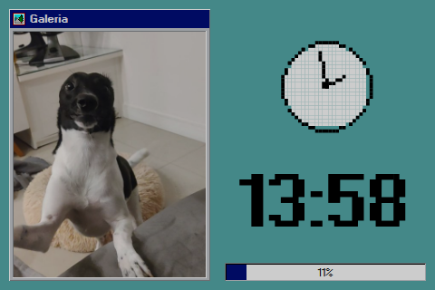
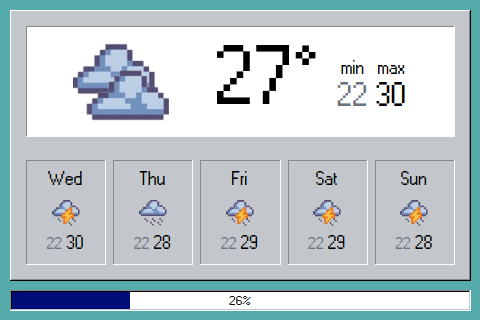
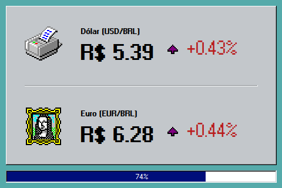
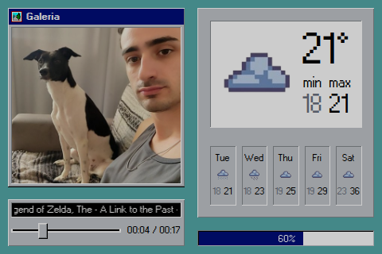
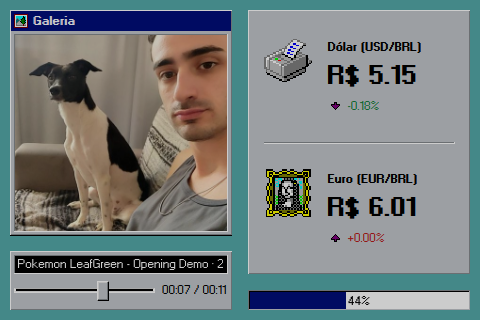
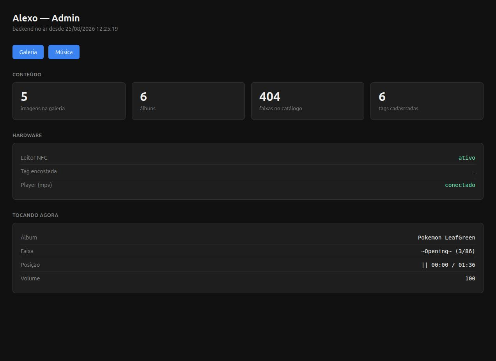
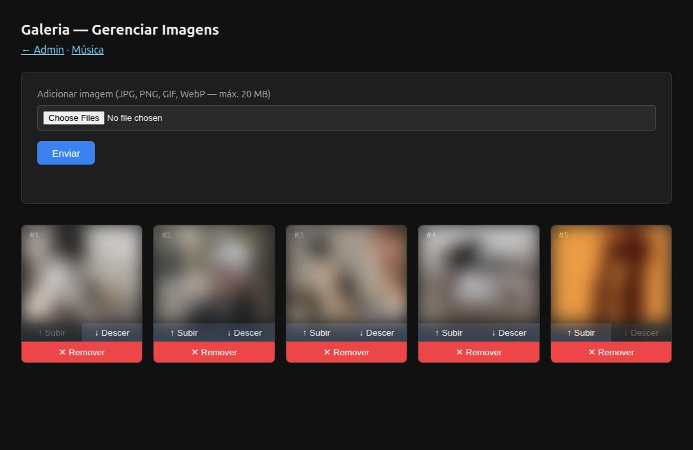
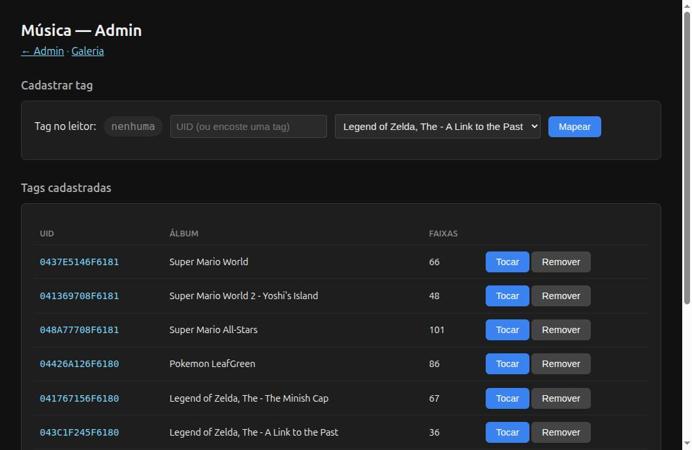
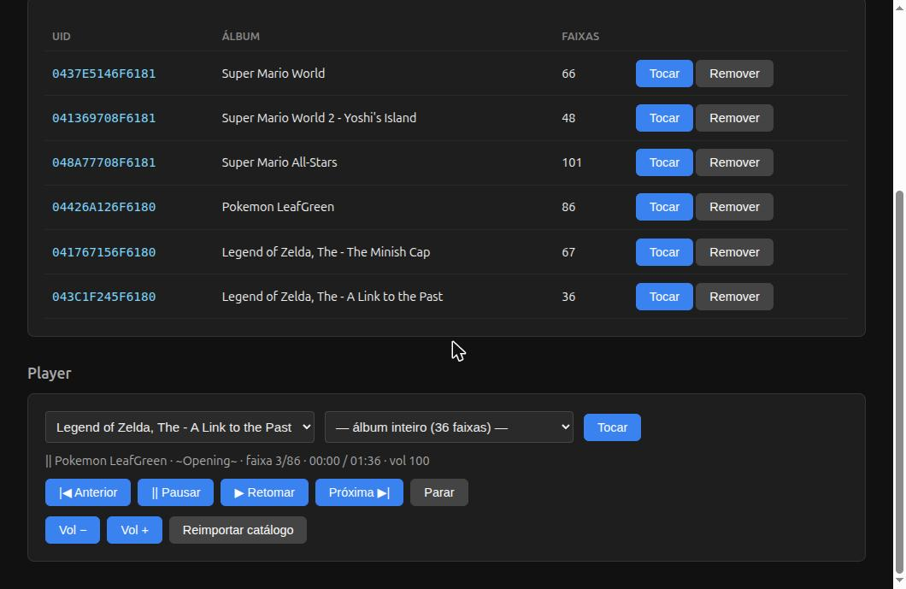

# Alexo

Alexo is a Windows 95-themed dashboard that runs on a 3.5" screen driven by a Raspberry Pi Zero W.
It shows weather, forecasts, exchange rates and tasks — and plays music when you place an NFC tag
on it, Tonie/Yoto style.

https://github.com/user-attachments/assets/89a0e55d-b3e0-4089-ac47-a3ae647a1f58

## Features

- **NFC music player** — tap a tag, the mapped album plays; lift it, the music pauses; put the
  same tag back, it resumes where it stopped
- **Weather** — current conditions and a 5-day forecast from the Open-Meteo API
- **Pixelated clock** — a retro clock rendered on a canvas
- **Exchange rates** and **Todoist** tasks
- **Photo gallery** — a slideshow beside the main screens, managed from a web admin
- **Real-time updates** over WebSocket
- **Windows 95 theme** via [`@react95/core`](https://react95.github.io/React95/)
- **Built for a small screen** — the whole UI targets 500×320

## Screens

The screen is split in two: the photo gallery on the left, the rotating screens on the right.

| Clock | Weather Forecast | Exchange Rate |
|:---:|:---:|:---:|
|  |  |  |

These three rotate on a 10-second carousel. Calendar, Todoist and the NFC message screen exist as
routes but are not part of the rotation.

When music is playing, a player panel takes the bottom of the left column and the gallery shrinks
to make room. It disappears a minute after the music stops, and the gallery grows back. The title
scrolls because an album name plus a track name never fits 240 pixels.

| Now playing | Another album |
|:---:|:---:|
|  |  |

## The music player

A PN532 NFC reader is wired to the Pi. Each tag maps to a **folder of MP3s** — an album, not a
single track — so `next`/`previous` have somewhere to go.

| Gesture | What happens |
|---|---|
| Tag placed | The mapped album starts from the first track |
| Tag removed | Playback pauses, position preserved |
| Same tag back | Resumes where it stopped |
| Different tag | Switches album, starts over |
| Tag with no mapping | Ignored (logged) |

While something is playing, a player panel appears under the gallery and disappears one minute
after the music stops. It has **no controls on purpose** — the tag is the control. Buttons on
screen would create contradictory states, like "paused" while the tag is still on the reader.

### Setting it up

1. Copy album folders into `backend/uploads/music/` on the Pi (one folder per album).
2. Build the catalogue:
   ```bash
   node backend/scripts/import-music.js --dry-run   # report only
   node backend/scripts/import-music.js
   ```
   Track ids are a hash of the file path, not random, so re-importing is idempotent: new files
   are added, deleted ones removed, and existing ones keep their id and their tag mapping.
3. Open **`/admin/music`**, hold a tag on the reader — the page fills in the UID for you — pick
   an album, and save.

### Hardware

| Part | Notes |
|---|---|
| PN532 NFC reader | **I2C mode**, DIP switch `1 \| 0`. Runs on 3.3V; no level shifting needed |
| MAX98357A | I2S DAC + amplifier, ALSA device `hw:0,0` |
| 4Ω/3W speaker | Passive |

The reader is on **`/dev/i2c-3`**, a software (bit-banged) bus created by the `i2c-gpio` overlay
on GPIO14/15. That is not the hardware I2C bus: the module is soldered directly to the UART pins
and cannot be moved, and the BCM2835 has no hardware I2C function on those pins.

```
dtoverlay=i2c-gpio,i2c_gpio_sda=15,i2c_gpio_scl=14,bus=3   # /boot/config.txt
```

The one-second check that the hardware is alive:

```bash
i2cdetect -y 3      # 0x24 should appear
```

Beware: `0x24` showing up only proves the chip acknowledges its address. **It says nothing about
the RF field.** A badly positioned module answers every command and reads no tags at all, which
looks exactly like a software bug. Use `nfc-signal.py` (below) to check the field itself.

## Architecture

A monorepo with two halves and a deliberately thin seam between them.

### Frontend
- React 18 + TypeScript, built with Vite
- Tailwind CSS + React95 components
- React Router v6

### Backend
- Node.js (the Pi runs 14.15.1) + Express
- `ws` for WebSocket
- In production it serves the API *and* the built frontend on one port

| Module | Responsibility |
|---|---|
| `server.js` | HTTP routes, admin pages, startup wiring |
| `ws.js` | WebSocket broadcast; `type` is the discriminator |
| `state.js` | Gallery, music catalogue, tag mappings, player state |
| `nfcReader.js` | PN532 over I2C; emits `tag-present` / `tag-vanish` |
| `musicPlayer.js` | mpv over its JSON IPC socket |
| `musicController.js` | The glue — the only module that sees all of the above |
| `musicCatalog.js` | Derives the catalogue from what is on disk |

`nfcReader` and `musicPlayer` do not know about each other: the reader knows nothing about music,
the player knows nothing about tags.

### Environment configuration
A single `.env` at the root configures both halves. In development they run on separate ports with
CORS; in production the backend serves everything.

## Getting Started

### Prerequisites

- Node.js 14.15.1 or newer
- Raspberry Pi Zero W with a 3.5" screen, for deployment

### Installation

```bash
git clone https://github.com/ggdaltoso/alexo.git
cd alexo
npm install
cd frontend && npm install && cd ..
cd backend && npm install && cd ..
cp .env.example .env
```

### Environment variables

**Development** (`.env`):
```bash
PORT=3001
NODE_ENV=development
VITE_API_URL=http://localhost:3001
VITE_WS_URL=ws://localhost:3001
VITE_TODOIST_API_TOKEN=your_todoist_api_token_here
```

**Production**:
```bash
PORT=3001
NODE_ENV=production
VITE_API_URL=              # empty = relative URLs
VITE_WS_URL=ws://localhost:3001
VITE_TODOIST_API_TOKEN=your_todoist_api_token_here
```

Backend-only variables, all optional:

| Variable | Default | Purpose |
|---|---|---|
| `PN532_I2C_BUS` | `3` | I2C bus for the NFC reader |
| `PN532_POLL_MS` | `300` | Interval between tag scans |
| `PN532_STATUS_POLL_MS` | `50` | Interval between status reads inside a scan |
| `MPV_SOCKET` | `/tmp/alexo-mpv.sock` | mpv IPC socket |
| `MPV_AUDIO_DEVICE` | `alsa/hw:0,0` | ALSA output |
| `MPV_EXTERNAL` | unset | `1` = never spawn mpv, only wait for the socket |

#### Getting your Todoist API token

[Todoist Settings](https://app.todoist.com/app/settings/integrations) → **Developer** → copy the
**API token** into `.env` as `VITE_TODOIST_API_TOKEN`.

### Development

```bash
npm run dev            # both halves
npm run dev:frontend
npm run dev:backend
```

Without the hardware, `nfcReader.init()` and `musicPlayer.init()` log a warning and the server
comes up anyway, just without NFC and audio. To exercise the music flow on a dev machine:

```bash
curl -X POST localhost:3001/api/nfc-tag/simulate \
  -H 'Content-Type: application/json' \
  -d '{"uid":"04A224B2","event":"present"}'
```

### Production build

```bash
npm run build   # frontend/dist/
npm start       # serves API + frontend on 3001
```

## Deploy to the Raspberry Pi

```bash
npm run deploy
```

| Script | What it does |
|---|---|
| `npm run deploy` | Builds the frontend, syncs files, installs backend deps, restarts services |
| `npm run deploy:dry` | Shows what *would* be sent — changes nothing |
| `npm run deploy:fast` | Skips the frontend build, sends the current `dist` |
| `npm run deploy:no-restart` | Sends files, leaves the old code running |

All of them accept extra flags after `--`:

```bash
npm run deploy -- --host pi@192.168.1.50
```

Set the target once in `.env.deploy` at the repo root (gitignored):

```bash
ALEXO_DEPLOY_HOST=pi@192.168.1.50
ALEXO_DEPLOY_PATH=/home/pi/alexo
```

Precedence: **flag > environment variable > `.env.deploy` > default**.

### What the deploy never touches

| Path | Why |
|---|---|
| `backend/data/` | Gallery, music catalogue, tag mappings |
| `backend/uploads/` | Photos and MP3s |
| `.env` | Production config, including the Todoist token |
| `node_modules/` | Reinstalled on the Pi — it has native addons |
| `/etc/systemd/system/` | Units are installed separately (below) |

`rsync` runs **without `--delete`**, so a deploy never removes files from the Pi. It also only
lists files that differ — an empty list means the Pi is already current, not that a step was
skipped.

A deploy can take longer than two minutes. Run it in a way that survives that, or it gets killed
after syncing but before restarting the services.

### First-time setup

```bash
ssh-copy-id pi@<ip>                                   # the script refuses to run without this
ssh pi@<ip> "mkdir -p /home/pi/alexo"
scp .env.production pi@<ip>:/home/pi/alexo/.env
npm run deploy:no-restart                             # services do not exist yet
```

Then install the systemd units.

### Systemd units

The units live in **`deploy/systemd/`** and are versioned. They used to exist only on the Pi and
silently drifted from what the docs claimed, so they belong in the repo.

```bash
scp deploy/systemd/*.service pi@<ip>:/tmp/
ssh pi@<ip> 'sudo cp /tmp/*.service /etc/systemd/system/ \
  && sudo systemctl daemon-reload \
  && sudo systemctl enable --now alexo-mpv alexo alexo-display wifi-powersave-off'
```

| Unit | Role |
|---|---|
| `alexo.service` | The Node backend |
| `alexo-mpv.service` | An idle mpv that owns the IPC socket |
| `alexo-display.service` | Chromium in kiosk mode |
| `wifi-powersave-off.service` | Disables Wi-Fi power save at boot |
| `wifi-monitor.service` | Optional; samples Wi-Fi health into the journal |

Two things about these units are load-bearing and easy to undo by accident:

**`alexo.service` calls `node` directly, not `npm start`.** npm alone takes ~13s to start on this
Pi, and during boot, with the SD card contended, that layer cost **three minutes**. Going direct
took boot-to-listening from 3m19s down to 32s.

**mpv is its own service, not a child of the backend.** It takes ~11s to open its IPC socket; as a
separate unit those 11s happen in parallel with the rest of the boot, and it gets `Restart=always`
of its own. The backend connects to whatever socket it finds — set `MPV_EXTERNAL=1` so it waits
for that socket instead of racing to spawn a second mpv.

> `systemctl disable` **deletes the unit** if `/etc/systemd/system/<name>.service` is a symlink
> rather than a regular file. Copy units in with `cp --remove-destination`.

## API Reference

### Music

```
GET    /api/music/albums              [{album, trackCount}]
GET    /api/music/tracks[?album=]
POST   /api/music/import              rescan the disk, rewrite the catalogue
GET    /api/music/tags
POST   /api/music/tags                {uid, album}   (upsert)
DELETE /api/music/tags/:uid
GET    /api/music/reader              the tag on the reader right now
GET    /api/music/player/status
POST   /api/music/player/:action      play|pause|resume|restart|next|previous|volume|stop
POST   /api/nfc-tag/simulate          {uid, event: 'present'|'remove'}
```

`POST /api/music/tags` rejects an album with no tracks: otherwise a typo would only surface later,
when you tap the tag, far from where the mistake was made.

### Gallery

```
GET    /api/gallery
POST   /api/gallery/upload            multipart, field 'image'
PUT    /api/gallery/reorder
DELETE /api/gallery/:id
```

Uploads are **downscaled before being registered** — see *Photos* under Raspberry Pi notes.

### Messages

```
POST /api/nfc                         {type, message}
```

Unrelated to the music player despite the name: this is for an external device (a phone) pushing a
message to the screen. The two NFC paths are deliberately independent.

### Admin pages

Server-rendered, no build step, no auth — they are meant for a device on your own network.

| Page | Purpose |
|---|---|
| `/admin` | Dashboard: content counts, reader state, what is playing |
| `/admin/music` | Tag → album mapping, player controls, catalogue re-import |
| `/admin/gallery` | Photo upload and ordering |

| Dashboard | Gallery |
|:---:|:---:|
|  |  |

| Music — tag mapping | Music — player |
|:---:|:---:|
|  |  |

The dashboard polls the reader and the player every two seconds, so "Tag encostada" and "Tocando
agora" reflect the device live. On the music page, holding a tag on the reader fills in the UID
field for you — the UID comes from the same code path the player uses, so the two cannot disagree.

> Gallery photos are blurred in this screenshot; they are personal pictures, not part of the
> project.

### WebSocket

Same port as HTTP. Every frame carries a `type` field, and **`type` is the discriminator** —
`broadcast()` sends to every client with no filtering, so each listener must switch on it.

```jsonc
{ "type": "nfc_message", "messageType": "info", "message": "...", "timestamp": 0 }
{ "type": "gallery_updated" }
{ "type": "music_tracks_updated" }
{ "type": "music_tags_updated" }
{ "type": "music_playback_state", "album": "...", "trackIndex": 0, "trackCount": 36,
  "isPlaying": true, "position": 12.5, "positionAt": 0, "stateChangedAt": 0, "duration": 195,
  "volume": 100, "activeTagUid": "..." }
```

`music_playback_state` is emitted **only on real transitions**, never once per second. It carries
`position` together with `positionAt` so the client can interpolate locally between events.
`stateChangedAt` is separate on purpose: it is stable across reads, so the UI can tell how long ago
playback stopped.

## Raspberry Pi Zero W notes

A single ARMv6 core, 430 MB of RAM, and Wi-Fi that shares the SDIO controller with the SD card.
That last detail turns memory pressure into network failures, which is not obvious when you are
staring at a dropped connection.

### Photos

Phone photos arrive at 3468×4624. The file is small because JPEG compresses well, but the browser
has to decompress it to draw, and then each pixel costs 4 bytes: **61 MB of RAM for one photo**,
displayed in a panel about 240×230.

Five such photos were 190 MB decoded, which filled swap, which hammered the SD card, which starved
the Wi-Fi radio on the shared SDIO bus. The Pi dropped off the network every few hours.

`POST /api/gallery/upload` now downscales every photo to 800px on the long side before registering
it, so this cannot come back through the admin. For photos already on disk:

```bash
python3 backend/scripts/resize-gallery.py --dry-run
python3 backend/scripts/resize-gallery.py          # originals kept in uploads/gallery-originais/
```

After the fix: 190 MB → 8.2 MB decoded, available memory 80 MB → ~250 MB, and the drops stopped.

### Bundle size

`@react95/icons` must be imported **one icon at a time**:

```ts
import { Wangimg128 } from '@react95/icons/Wangimg128';   //  880 KB bundle
import { Wangimg128 } from '@react95/icons';              // 4451 KB bundle
```

The package re-exports 975 icon modules from a barrel and does not declare `sideEffects: false`, so
the bundler keeps almost all of them. Collapsing those imports back into one line looks like
tidying and costs 3.5 MB on a device that loads the page over Wi-Fi on every restart.

Check the size Vite prints at the end of a build when touching UI dependencies. Both upgrades that
caused this passed typecheck and build without a single warning.

### Node 14

**Never use `crypto.randomUUID()`** — it needs Node 14.17 and the Pi runs 14.15.1. Use
`backend/ids.js`. The failure is nasty: it throws inside a multer storage callback, outside
Express's error handler, and takes the whole process down.

### Audio

mpv is driven over its JSON IPC socket by a hand-written client rather than a library, because the
protocol is one line of JSON per command and the usual wrapper's connection timeout does not cover
this hardware's ~11s startup.

**Known issue:** audio distorts above roughly volume 60. Undervoltage is ruled out
(`vcgencmd get_throttled` returns `0x0`). The remaining suspect is the MAX98357A's fixed analog
gain — with `GAIN` floating it applies 9 dB, and game soundtracks are mastered hot. The fix is a
jumper, not code: `GAIN` to `VIN` for 6 dB and less volume, or a more efficient speaker.

## Troubleshooting

### Wi-Fi drops

```bash
journalctl -u wifi-monitor --since '-6h' | grep ' ?  '     # real disconnects
journalctl -u wifi-monitor --since '-6h' | grep SEM_RESPOSTA
```

`?` where the signal should be means the interface is disassociated — an actual drop. A slow ping
with a healthy signal is something else: with load above ~2 on one core, the ping process is
starved by the scheduler and the sample fails while the network is fine. **Do not conflate the
two.** High load with idle CPU means processes blocked on I/O, which points at swap, not at CPU.

Measure from the Pi, never from your workstation: an outside measurement loses the connection and
the data at exactly the moment you care about.

### NFC not reading

Check the RF field before suspecting code — `i2cdetect` finding `0x24` does not prove the antenna
works:

```bash
python3 backend/scripts/nfc-signal.py      # live bar, hold a tag and move it
```

If the bar stays full, the hardware is fine and the problem is in software.

### The reader works in Python but not in Node

Response length matters. Reading more bytes than a frame contains consumes what follows and
desynchronises every later command — an easy way to make a working reader look broken.
`nfc-node-vs-python.sh` runs both implementations against the same stationary tag, back to back,
so the answer is unambiguous.

## Bench tools

`backend/scripts/`, all dependency-free:

| Tool | Purpose |
|---|---|
| `pn532-i2c-probe.py` | Full NFC diagnostic. The reference implementation of the protocol |
| `nfc-read-uid.py` | Prints UIDs only — for registering a new tag |
| `nfc-signal.py` | Live signal bar — for positioning the module |
| `nfc-player-sim.py` | Simulates the player behaviour with no audio |
| `nfc-reader-test.js` | Exercises `nfcReader.js` itself |
| `nfc-node-vs-python.sh` | Runs both readers on the same tag, same session |
| `music-player-test.js` | Exercises `musicPlayer.js` with real audio |
| `import-music.js` | Builds the music catalogue from disk |
| `music-durations.py` | Reads MP3 durations — separates songs from short jingles |
| `resize-gallery.py` | Downscales gallery photos |

`scripts/wifi-monitor.sh` samples Wi-Fi health; run it as `wifi-monitor.service` so the output
lands in the journal and survives a reboot.

## Project structure

```
alexo/
├── backend/
│   ├── server.js            # routes, admin pages, startup
│   ├── ws.js                # WebSocket broadcast
│   ├── state.js             # gallery, catalogue, tags, player state
│   ├── nfcReader.js         # PN532 over I2C
│   ├── musicPlayer.js       # mpv IPC client
│   ├── musicController.js   # NFC ←→ player glue
│   ├── musicCatalog.js      # disk → catalogue
│   ├── ids.js               # UUID v4 without crypto.randomUUID
│   ├── scripts/             # bench tools
│   ├── data/                # JSON state (never deployed)
│   └── uploads/             # photos and MP3s (never deployed)
├── frontend/src/
│   ├── components/          # Galeria, MusicPlayer, Letreiro, ...
│   ├── screens/             # Clock, Forecast, Exchange, ...
│   ├── contexts/            # AppContext: WebSocket, navigation, timer
│   ├── hooks/ services/ config/
│   └── index.css            # global styles, marquee, screen dimming
├── deploy/systemd/          # versioned units
├── scripts/                 # deploy.sh, wifi-monitor.sh
└── package.json
```

## Useful commands

```bash
# services
sudo systemctl restart alexo alexo-display
journalctl -u alexo.service -f
journalctl -u wifi-monitor -f

# hardware checks
i2cdetect -y 3                    # NFC reader answers at 0x24
aplay -l                          # audio device
vcgencmd get_throttled            # 0x0 = never undervolted
free -m                           # swap full = trouble ahead
```

> `pkill -f <pattern>` matches the command line of the shell running it. Over ssh it kills your own
> session and returns a confusing error. Kill by PID instead.

## License

MIT.
