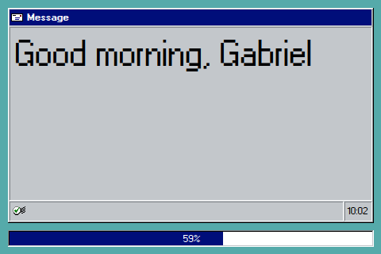
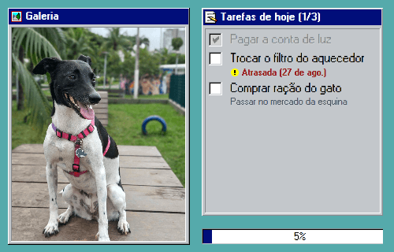

# Alexo

Alexo is a weather dashboard styled with a Windows 95 aesthetic, designed to run on a 3.5" screen powered by a Raspberry Pi Zero. It displays current weather, daily forecasts, calendar, and messages with real-time updates via WebSocket.


https://github.com/user-attachments/assets/89a0e55d-b3e0-4089-ac47-a3ae647a1f58


## Features

- **Weather Information**: Displays current weather and a 5-day forecast using the Open-Meteo API
- **Pixelated Clock**: A retro-style clock rendered on a canvas
- **Calendar View**: Visual calendar interface
- **Message Screen**: Real-time message display with NFC integration
- **Todoist Integration**: Manage your tasks directly from the dashboard
- **WebSocket Communication**: Real-time updates between frontend and backend
- **Windows 95 Theme**: Styled using [`@react95/core`](https://react95.github.io/React95/) and custom CSS
- **Optimized for Small Screens**: Designed to fit and function on a 3.5" display

## Screens

| Clock | Weather Forecast |
|:---:|:---:|
|  |  |

| Exchange Rate | NFC Message |
|:---:|:---:|
|  |  |

| Todoist |
|:---:|
|  |


## Architecture

The project is structured as a monorepo with two main components:

### Frontend
- **Framework**: React 18 with TypeScript
- **Build Tool**: Vite 4
- **Styling**: Tailwind CSS + React95 components
- **Routing**: React Router v6
- **Key Libraries**:
  - `@react95/core` & `@react95/icons` - Windows 95 UI components

### Backend
- **Runtime**: Node.js (v14.x recommended, works with newer versions)
- **Framework**: Express.js
- **WebSocket**: ws library for real-time communication
- **Production Mode**: Serves both API and static frontend files on a single port
- **API Endpoints**:
  - `POST /api/nfc` - Receive NFC messages and broadcast via WebSocket

### Environment Configuration
- **Single `.env` file** at the root configures both frontend and backend
- **Development**: Backend and frontend run on separate ports with CORS enabled
- **Production**: Backend serves frontend static files (no CORS needed)

## Getting Started

### Prerequisites

- Node.js (v14.15.1 or higher)
- npm (v6.14.8 or higher)
- Raspberry Pi Zero with a 3.5" screen (for deployment)

### Installation

1. Clone the repository:
   ```bash
   git clone https://github.com/ggdaltoso/alexo.git
   cd alexo
   ```

2. Install dependencies for all packages:
   ```bash
   npm install
   cd frontend && npm install && cd ..
   cd backend && npm install && cd ..
   ```

3. Configure environment variables:
   ```bash
   # Copy the example file
   cp .env.example .env
   
   # Edit .env for your environment
   # For development, default values should work
   # For production, see .env.production example
   ```

### Environment Variables

The project uses a single `.env` file at the root that configures both frontend and backend:

**Development** (`.env`):
```bash
PORT=3001
NODE_ENV=development
VITE_API_URL=http://localhost:3001
VITE_WS_URL=ws://localhost:3001
VITE_TODOIST_API_TOKEN=your_todoist_api_token_here
```

**Production** (`.env.production` or update `.env`):
```bash
PORT=3001
NODE_ENV=production
VITE_API_URL=              # Empty = uses relative URLs
VITE_WS_URL=ws://localhost:3001
VITE_TODOIST_API_TOKEN=your_todoist_api_token_here
```

#### Getting Your Todoist API Token

To use the Todoist integration:

1. Go to [Todoist Settings](https://app.todoist.com/app/settings/integrations)
2. Scroll down to **Developer** section
3. Copy your **API token**
4. Add it to your `.env` file as `VITE_TODOIST_API_TOKEN`

### Development

Run both frontend and backend in development mode:

```bash
npm run dev
```

This will start:
- **Backend** on `http://localhost:3001` (WebSocket server + API)
- **Frontend** on Vite dev server (separate port with CORS enabled)

Or run them separately:

```bash
# Frontend only
npm run dev:frontend

# Backend only
npm run dev:backend
```

### Production Build

In production, the backend serves both the API and the frontend static files on a single port.

1. Build the frontend:
   ```bash
   npm run build
   ```
   This generates optimized files in `frontend/dist/`

2. Start the production server:
   ```bash
   npm start
   ```
   The server will run on `http://localhost:3001` serving both API and frontend.

### Deploy to Raspberry Pi

Day-to-day deploys are a single command:

```bash
npm run deploy
```

| Script | What it does |
|---|---|
| `npm run deploy` | Builds the frontend, syncs files, installs backend deps, restarts the services |
| `npm run deploy:dry` | Shows what *would* be sent — changes nothing on the Pi |
| `npm run deploy:fast` | Skips the frontend build, sends the current `dist` |
| `npm run deploy:no-restart` | Sends files but leaves the services running the old code |

All four accept extra flags after `--`:

```bash
npm run deploy -- --host pi@192.168.1.50
npm run deploy:dry -- --path /srv/alexo
```

Set the target once in `.env.deploy` at the repo root (gitignored):

```bash
ALEXO_DEPLOY_HOST=pi@192.168.1.50
ALEXO_DEPLOY_PATH=/home/pi/alexo
```

Precedence is **flag > environment variable > `.env.deploy` > default**.

#### What the deploy never touches

This content exists only on the Pi and is deliberately excluded:

| Path | Why |
|---|---|
| `backend/data/` | `gallery.json` and other persisted state |
| `backend/uploads/` | gallery images (and, later, music files) |
| `.env` | production config, including the Todoist token |
| `node_modules/` | reinstalled on the Pi — it has native addons |

`rsync` runs **without `--delete`**, so a deploy never removes files from the Pi.

Note that `rsync` only lists files that actually differ. An empty file list under
`[backend — ...]` means the Pi is already up to date, not that the step was skipped.

#### First-time setup

The deploy script assumes the Pi is already prepared. Do this once:

1. Set up passwordless ssh (the script refuses to start without it, so that
   `rsync` does not prompt for a password mid-deploy):
   ```bash
   ssh-copy-id pi@<raspberry-pi-ip>
   ```

2. Create the target directory and drop in the production environment file:
   ```bash
   ssh pi@<raspberry-pi-ip> "mkdir -p /home/pi/alexo"
   scp .env.production pi@<raspberry-pi-ip>:/home/pi/alexo/.env
   ```

3. Run the first deploy without restarting (the services do not exist yet):
   ```bash
   npm run deploy:no-restart
   ```

4. Create the systemd services (next section). After that, plain
   `npm run deploy` handles everything.

To run the server by hand instead of via systemd:

```bash
ssh pi@<raspberry-pi-ip>
cd /home/pi/alexo && npm start
chromium-browser --kiosk --incognito --disable-infobars http://localhost:3001
```

#### Create Systemd Services to Run on Boot

These are what `npm run deploy` restarts at the end of a deploy, and what
launches Alexo on boot:

1. Create a service file:
   ```bash
   sudo nano /etc/systemd/system/alexo.service
   ```

2. Add the following content:
   ```ini
   [Unit]
   Description=Alexo Weather Dashboard
   After=network-online.target
   Requires=network-online.target

   [Service]
   Type=simple
   User=pi
   WorkingDirectory=/home/pi/alexo
   ExecStart=/home/pi/node-v14.15.1-linux-armv6l/bin/npm start
   Restart=always
   RestartSec=10
   Environment="NODE_ENV=production"
   Environment="PATH=/home/pi/node-v14.15.1-linux-armv6l/bin:/usr/local/bin:/usr/bin:/bin"

   [Install]
   WantedBy=multi-user.target
   ```

   Adjust both paths to wherever Node actually lives on your Pi
   (`ls -d ~/node-v*` if it was installed from a tarball). Both lines matter:
   systemd does not search `PATH` for `ExecStart`, and `npm` is a script whose
   `#!/usr/bin/env node` shebang needs `node` on `PATH` to run at all.

3. Enable and start the service:
   ```bash
   sudo systemctl enable alexo.service
   sudo systemctl start alexo.service
   ```

4. Create a separate service for the Chromium kiosk display:
   ```bash
   sudo nano /etc/systemd/system/alexo-display.service
   ```

5. Add the following content:
   ```ini
   [Unit]
   Description=Alexo Chromium Display
   After=graphical.target alexo.service
   Requires=alexo.service

   [Service]
   User=pi
   ExecStart=/usr/bin/chromium-browser --kiosk --incognito --disable-infobars http://localhost:3001
   Environment=DISPLAY=:0
   Restart=always
   RestartSec=10

   [Install]
   WantedBy=graphical.target
   ```

6. Enable and start the display service:
   ```bash
   sudo systemctl enable alexo-display.service
   sudo systemctl start alexo-display.service
   ```

## API Reference

### Backend Endpoints

#### POST /api/nfc
Receives NFC messages and broadcasts them to all connected WebSocket clients.

**Request Body:**
```json
{
  "type": "string",
  "message": "string"
}
```

**Response:**
```json
{
  "ok": true
}
```

### WebSocket Connection

The backend runs a WebSocket server on the same port as the HTTP server (default: 3001).

**Connection URL:** `ws://localhost:3001`

**Message Format:**
```json
{
  "type": "string",
  "message": "string",
  "timestamp": 1234567890
}
```

## Project Structure

```
alexo/
├── .env                  # Environment variables (not committed)
├── .env.example          # Example environment configuration
├── .env.production       # Production environment template
├── frontend/             # React frontend application
│   ├── src/
│   │   ├── components/  # Reusable UI components
│   │   ├── screens/     # Main screen components
│   │   ├── contexts/    # React contexts
│   │   ├── hooks/       # Custom React hooks
│   │   ├── services/    # API and WebSocket services
│   │   └── config/      # Configuration files (reads VITE_ env vars)
│   └── dist/            # Production build output (served by backend)
├── backend/             # Express.js backend server
│   ├── server.js        # Main server file (serves API + static files)
│   ├── ws.js            # WebSocket server logic
│   └── state.js         # Application state management
└── package.json         # Root package with npm scripts
```

## License

This project is licensed under the MIT License.

## Useful Commands

Here are some helpful commands for managing and debugging Alexo:

### Development
- **Run both frontend and backend in development mode**
  ```bash
  npm run dev
  ```

- **Run only frontend**
  ```bash
  npm run dev:frontend
  ```

- **Run only backend**
  ```bash
  npm run dev:backend
  ```

### Production
- **Build frontend for production**
  ```bash
  npm run build
  ```

- **Start production server (serves both API and frontend)**
  ```bash
  npm start
  ```

### Deploy

- **Full deploy (build + sync + restart)**
  ```bash
  npm run deploy
  ```

- **Preview what would be sent, without touching the Pi**
  ```bash
  npm run deploy:dry
  ```

- **Skip the frontend build (backend-only change)**
  ```bash
  npm run deploy:fast
  ```

- **Sync files without restarting the services**
  ```bash
  npm run deploy:no-restart
  ```

- **See all flags**
  ```bash
  npm run deploy -- --help
  ```

### Systemd Services (Raspberry Pi)

- **Check service logs in real-time**
  ```bash
  journalctl -u alexo.service -f
  journalctl -u alexo-display.service -f
  ```

- **Restart services**
  ```bash
  sudo systemctl restart alexo.service
  sudo systemctl restart alexo-display.service
  ```

- **Stop services**
  ```bash
  sudo systemctl stop alexo.service
  sudo systemctl stop alexo-display.service
  ```

- **Check service status**
  ```bash
  sudo systemctl status alexo.service
  sudo systemctl status alexo-display.service
  ```

- **Enable services to start on boot**
  ```bash
  sudo systemctl enable alexo.service
  sudo systemctl enable alexo-display.service
  ```

- **Disable services**
  ```bash
  sudo systemctl disable alexo.service
  sudo systemctl disable alexo-display.service
  ```
