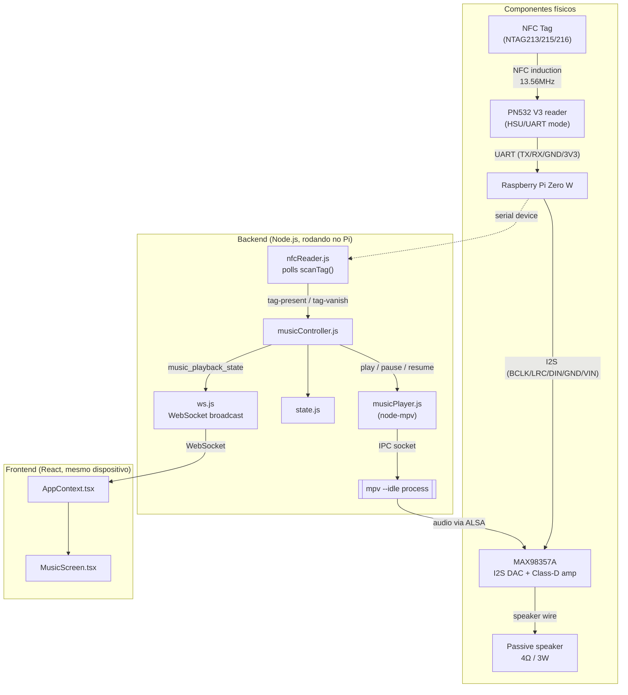

# Player de música ativado por tag NFC

## Contexto

O Alexo hoje já tem um pipeline NFC "acidental": um dispositivo externo (celular/app) faz `POST /api/nfc` com `{type, message}` e o backend retransmite via WebSocket para mostrar uma mensagem na tela por 10s. Essa feature é totalmente separada da nova: agora queremos um **leitor NFC físico ligado direto no Pi Zero W**, controlado pelo Node, que ao detectar uma tag toca uma música mapeada àquela tag (e pausa quando a tag é removida) — um efeito "caixinha tipo Tonie/Yoto". O hardware já foi decidido em conversa anterior:

- **Áudio**: MAX98357A (DAC I2S + ampli Classe D) + speaker passivo 4Ω/3W.
- **Leitura NFC**: módulo PN532 via **UART/serial** (biblioteca npm `pn532`, pacote `techniq/node-pn532`), usando `scanTag()` em polling — suporta **NTAG (203/213/215/216) e Mifare Ultralight**, mas explicitamente **não suporta Mifare Classic**. Essa lib tem suporte a I2C, mas está marcado como WIP há quase 10 anos sem retomada — por isso a escolha é UART, o caminho testado de verdade pela lib. Sem evento nativo de "tag removida": a detecção de presença/ausência é implementada por nós, comparando UID entre polls sucessivos.
- **Playback**: `mpv --idle` controlado via socket IPC JSON, usando o pacote `node-mpv`.
- **Gestão de conteúdo**: página admin HTML server-rendered (`/admin/music`), no mesmo molde da `/admin/gallery` que já existe.

Escopo v1: **1 tag = 1 música** (sem playlist/fila). "Pular música" não tem alvo definido nesse escopo — vira "reiniciar a faixa atual", deixado explícito na UI.

Essas duas features NFC (mensagem via HTTP externo vs. música via leitor físico) devem ficar **completamente desacopladas** no backend e no frontend — mesma tecnologia de transporte (WebSocket), fluxos de estado independentes.

## Diagrama

Fluxo lógico (hardware físico + módulos de software):



### Fiação (pinout GPIO)

Conexões físicas no header de 40 pinos do Pi Zero W (os pinos de I2S e UART são fixos pelo SoC, não é escolha de projeto):

```
Raspberry Pi Zero W — GPIO header (40 pinos)
─────────────────────────────────────────────

PN532 V3 — header de 4 furos (chaves SW1=0, SW2=0 → modo HSU)
  Esse header é dual-purpose: rótulos SDA/SCL impressos na frente (modo I2C),
  rótulos TXD/RXD impressos no verso da placa (modo HSU) — mesmos furos físicos.

    VCC             <──  5V           (pin 2)   ← NÃO usar o 3V3, ver nota abaixo
    GND             <──  GND          (pin 6)
    SDA (= TXD/HSU) ──►  RXD/GPIO15   (pin 10)  ← via divisor 1k/2k, ver nota
    SCL (= RXD/HSU) <──  TXD/GPIO14   (pin 8)   ← direto, sem divisor

  Header de 8 furos (SCK/MISO/MOSI/SS/VCC/GND/IRQ/RSTO) — usado só em modo SPI,
  sem uso no projeto (IRQ/RSTO não são necessários pro polling via scanTag()).

MAX98357A — I2S DAC + amplificador Classe D (7 pinos, na ordem física do módulo)

    LRC   <──  GPIO19     (pin 35)
    BCLK  <──  GPIO18     (pin 12)
    DIN   <──  GPIO21     (pin 40, "DOUT")
    GAIN        sem conexão (flutuando = ganho padrão de 9dB)
    SD          sem conexão (pull-up interno = ampli sempre ligado)
    GND   <──  GND        (pin 9)
    VIN   <──  5V         (pin 2)

    saída speaker+/speaker- ──► Passive speaker 4Ω / 3W

NFC tag (NTAG213/215/216) ──► sem fio, só aproximação 13.56MHz da antena do PN532
```

Notas:
- **Ressalva de UART**: no Pi Zero W, o Bluetooth ocupa o UART primário (PL011) por padrão, deixando só a mini-UART (`/dev/ttyS0`) exposta em GPIO14/15. Testar essa primeiro; se instável, adicionar `dtoverlay=disable-bt` em `/boot/config.txt` pra liberar o UART completo (ver seção de verificação abaixo).
- **VCC do PN532 vai no 5V, não no 3V3.** Esta nota já disse o contrário e estava errada —
  a versão anterior recomendava 3.3V "pra bater com o nível lógico do Pi", e essa é a causa
  provável do módulo nunca ter respondido (ver diagnóstico abaixo). Duas fontes independentes:
  a página do módulo diz *"On-board level shifter, Standard 5V TTL for I2C and UART, 3.3V TTL
  SPI"* — o shifter precisa do 5V como referência; e a doc da lib `pn532pi` diz *"The Raspberry
  Pi 3.3v regulator does not provide enough current to drive the PN532 chip. If you try to run
  the PN532 off your Raspberry Pi 3.3v it will reset randomly and may not respond to commands."*
  A segunda explica por que o LED do módulo fica aceso normalmente: a alimentação existe, e só
  colapsa quando o PN532 energiza o campo RF — exatamente quando precisaria responder.
- **Divisor resistivo obrigatório no TX do módulo.** Com a placa em 5V, o TXD dela passa a sair
  em 5V, e os GPIOs do Pi **não são tolerantes a 5V**. As direções são assimétricas:
  Pi→módulo é seguro (3.3V passa folgado do limiar TTL de ~2.0V), módulo→Pi não é. Divisor só
  nessa linha: `módulo SDA(TXD) ──[1kΩ]──┬──► Pi pino 10`, com `[2kΩ]` desse nó para o GND.
  Entrega 5 × 2/3 = 3,33V. A linha Pi pino 8 → módulo SCL(RXD) fica direta.
- **DIN do MAX98357A** se conecta ao **DOUT** de I2S do Pi (GPIO21) — o Pi transmite os dados de áudio, o DAC só recebe.

## Áudio: configuração confirmada

Testado no Pi real em 23/08/2026 — som saiu pelo speaker, cadeia inteira validada
(I2S → MAX98357A → speaker, com decode de MP3).

Três linhas no `/boot/config.txt`, seguidas de reboot:

```
#dtparam=audio=on                     # desliga o snd_bcm2835 (HDMI), pro DAC virar card 0
dtparam=i2s=on
dtoverlay=max98357a,no-sdmode
```

Notas sobre cada uma:

- **`max98357a` em vez de `hifiberry-dac`**: o kernel do Pi (5.10.103+, Raspbian Buster)
  já traz o overlay específico do chip. O parâmetro `no-sdmode` é o que corresponde à
  nossa fiação — como o pino `SD` fica sem conexão (pull-up interno = ampli sempre
  ligado), o driver não deve tentar controlar esse pino. Sem `no-sdmode` ele assumiria
  o GPIO4 como controle de shutdown.
- **Desligar `dtparam=audio=on`** não é obrigatório, mas faz o DAC ser `card 0` e evita
  ter que selecionar placa em todo lugar. Reversível: é só descomentar. Perde-se áudio
  por HDMI, que nesse kiosk não é usado.

Resultado: `card 0: MAX98357A [MAX98357A], device 0` → device ALSA **`hw:0,0`**,
ou seja `--audio-device=alsa/hw:0,0` no `musicPlayer.js`.

### Volume é obrigatoriamente por software

`amixer -c 0 scontrols` retorna **vazio** — o MAX98357A não tem nenhum controle de
volume por hardware, e sem o `snd_bcm2835` não há mixer nenhum no sistema. Não é
limitação de configuração, é o chip: ele é um DAC + ampli de ganho fixo (o pino
`GAIN` flutuando = 9dB).

Consequência pro projeto: o `setVolume` do `musicPlayer.js` é a **única** forma de
controlar volume, via volume por software do mpv. Não existe fallback de `amixer`.

**Volume padrão: 45**, calibrado de ouvido com o speaker do projeto. Lembrando que a
escala do mpv é atenuação: `100` é ganho unitário, então 45 significa 45% da amplitude
do arquivo — nada é amplificado por software.

Como se chegou nesse número:

| Volume | Resultado |
|---|---|
| 30 | limpo, mas baixo demais |
| 45 | **escolhido** — audível e sem distorção incômoda |
| 60 | alto o suficiente, mas com distorção perceptível |

#### Pendência: distorção em volume alto

A partir de ~60 o som distorce. **Subtensão foi descartada** — `vcgencmd get_throttled`
retorna `0x0`, e esse bit é persistente desde o boot, então teria registrado se a fonte
tivesse afundado durante os testes altos. Também não é clipping de software, já que 60 é
atenuação, não amplificação.

A hipótese que sobra é o **ganho analógico fixo do MAX98357A**: com o pino `GAIN`
flutuando ele aplica 9dB, e trilhas de jogo são masterizadas quente — 9dB em cima disso
empurra o speaker de 3W além da excursão do cone.

Caminho quando for retomar (não bloqueia nada, 45 está utilizável): ligar `GAIN` direto
no `VIN` para baixar o ganho analógico a 6dB e subir o volume do mpv para perto de 100.
Soa mais alto *e* mais limpo, e ainda melhora a relação sinal-ruído, porque menos
atenuação digital deixa mais resolução. Tabela do pino:

| Ligação do pino GAIN | Ganho |
|---|---|
| 100kΩ para o GND | 15 dB |
| direto no GND | 12 dB |
| flutuando (atual) | 9 dB |
| direto no VIN | 6 dB |
| 100kΩ para o VIN | 3 dB |

Se depois de baixar o ganho ainda distorcer, o próximo teste é uma senoide via
`speaker-test`, que tira o MP3 da equação: senoide limpa + música distorcida aponta para
o material de origem, não para o hardware.

Deliberadamente **não** configuramos um plugin `softvol` do ALSA: criaria um segundo
lugar para ajustar a mesma coisa, com risco de multiplicar dois atenuadores sem
perceber. O volume é comportamento da aplicação.

### mpv: instalado e validado via IPC

`mpv 0.29.1` instalado no Pi em 23/08/2026, e o controle por socket IPC — que é a base do
`musicPlayer.js` — foi validado ponta a ponta contra uma faixa real:

| Comando IPC | Resultado |
|---|---|
| `loadfile <path>` | success, áudio tocando |
| `get_property duration` | `17.502041` |
| `get_property volume` | `30.0` |
| `set_property pause true` | posição **congelada** em `5.299909` por 2s |
| `set_property pause false` | retomou, avançou para `8.70517` |

O pause/resume preservando a posição é exatamente o mecanismo de que a regra
"mesma tag recolocada → retoma de onde parou" depende. Está provado no hardware.

Linha de comando validada:

```
mpv --idle=yes --no-video --audio-device=alsa/hw:0,0 --volume=30 \
    --input-ipc-server=/tmp/mpvsocket
```

#### ⚠ O mpv leva ~11s para subir nesse Pi

Medido: o socket IPC só aparece **11 segundos** depois de lançar o processo, com a CPU a
~50% durante a inicialização. Isso é com o cache de fontes já quente — na primeira
execução foi entre 10 e 20s. **Não é custo único, é toda vez.**

Três consequências de projeto:

1. **Confirma a decisão de subir o mpv com `--idle` no boot do backend.** Lançar o mpv sob
   demanda, na primeira tag, colocaria 11s de silêncio entre encostar a tag e ouvir som —
   inaceitável para o efeito "caixinha". O processo tem que já estar de pé, ocioso.
2. **`musicPlayer.init()` não pode assumir que o socket existe logo após o spawn.** Precisa
   esperar o socket aparecer, com timeout generoso (≥30s), e o boot do Express **não pode
   bloquear** nisso — inicialização assíncrona, e o backend sobe normalmente enquanto o mpv
   ainda está subindo.
3. **Verificar o timeout de conexão do `node-mpv`.** A lib espera o socket por conta
   própria; se o default dela for menor que ~15s, vai falhar por pouco nesse hardware.
   Conferir e aumentar explicitamente ao configurar.

### Pendência do ambiente: apt do Pi estava quebrado

O Raspbian Buster saiu do arquivo principal — `raspbian.raspberrypi.org` devolve 404 e
qualquer `apt install` falhava. Corrigido repontando o `/etc/apt/sources.list` para o
arquivo oficial de versões EOL (backup em `/etc/apt/sources.list.bak`):

```
deb http://legacy.raspbian.org/raspbian/ buster main contrib non-free rpi
```

Fica registrado porque afeta qualquer instalação futura nesse Pi, não só o mpv. O
`archive.raspberrypi.org/debian buster` (repo da Foundation) continua funcionando e não
foi tocado. Cuidado ao instalar coisas aqui: a imagem é antiga e a orientação do usuário é
mexer o mínimo — usar `apt-get install -s` (simulação) antes e conferir que o resumo diz
`0 upgraded, 0 to remove`, nunca rodar `apt upgrade`.

## NFC: diagnóstico em aberto (23/08/2026)

O módulo **não responde**. Zero bytes de retorno. Estado da investigação:

**Descartado — o lado do Pi está inteiramente sadio:**

- `/dev/serial0 → ttyS0` existe (exigiu `enable_uart=1` e remover `console=serial0,115200`
  do `cmdline.txt`, ambos já feitos)
- `raspi-gpio get 14,15` → `alt=5 func=TXD1` / `func=RXD1` — os pinos estão muxados na
  mini-UART
- nenhum processo segurando a porta (`fuser`), usuário no grupo `dialout`
- os frames saem corretos na linha: `00 00 ff 02 fe d4 02 2a 00` é o `GetFirmwareVersion`
  canônico, conferido byte a byte
- **duas implementações independentes** (o smoke test em Node e um probe em Python puro
  com `termios`) recebem zero bytes. Não é bug de código nem falta de biblioteca.

**Causa provável: VCC em 3.3V.** Ver as notas da seção de fiação — duas fontes
independentes dizem que o PN532 precisa de 5V, e a doc da `pn532pi` descreve o sintoma
exato ("may not respond to commands"). O LED aceso não descarta isso: a alimentação
colapsa só quando o chip energiza o campo RF.

**Próximos passos, em ordem:**

1. Conferir a chave DIP em HSU (`0 | 0` nessa placa) — custo zero, só olhar.
2. Mover VCC do pino 1 (3V3) para o pino 2 (5V), **com o divisor 1k/2k no TX do módulo**.
3. Se ainda mudo, o loopback isola de vez: tirar os dois fios de dados e jumpear o pino 8
   no pino 10 do Pi. Rodar `node backend/scripts/pn532-smoke-test.js --verbose` — se
   aparecerem linhas `<--` (o próprio comando ecoado, terminando em
   `TFI inesperado na resposta: 0xd4`), a UART do Pi está perfeita e o defeito é do módulo.

**Nota sobre a `pn532pi`:** é uma lib Python, não serve pro projeto (que é Node), mas a
documentação dela é a melhor referência de hardware que encontramos até agora. Vale
consultar antes de qualquer nova hipótese elétrica.

## Bug pré-existente a corrigir como pré-requisito

`frontend/src/contexts/AppContext.tsx:92-94` trata **qualquer** broadcast do WebSocket como se fosse uma `NFCMessage` (`setCurrentMessage(message)` sem checar `type`), incluindo o já existente `{type:'gallery_updated'}`, que não tem `message`/`timestamp`. Isso nunca explodiu na prática porque a Galeria faz polling e não escuta o WS — mas qualquer broadcast novo (como `music_playback_state`) vai colidir com o fluxo de interrupção de `/message` se isso não for corrigido primeiro.

## Backend

### Novos módulos (mesmo estilo de `backend/ws.js`/`backend/state.js` — arquivos pequenos e focados)

- **`backend/nfcReader.js`**: só cuida do hardware. `init()` abre a porta serial (`serialport` + `pn532`) dentro de `try/catch` — se a porta não existir (ex.: rodando num Mac/dev sem o UART), loga aviso e não faz nada, sem derrubar o servidor. Faz um `setInterval` curto (~300ms) chamando `rfid.scanTag()`; compara o UID retornado com o último UID visto: UID novo → emite `'tag-present'`; UID que sumiu (poll retorna sem tag) → emite `'tag-vanish'`. Essa lógica de presença/ausência é nossa, já que a lib não expõe um evento `vanish` pronto (diferente do que a `pn532-i2c` oferecia).
- **`backend/musicPlayer.js`**: só cuida do mpv. `init()` sobe `mpv --idle --input-ipc-server=<path>` via `node-mpv`. Métodos `play(track)`, `pause()`, `resume()`, `restart()`, `setVolume(v)`, `getStatus()`. Emite `'status'` com `{trackId, title, filename, isPlaying, position, duration, volume}` a cada mudança real reportada pelo mpv (play/pause/fim de faixa/seek).
- **`backend/musicController.js`**: a cola — é o único módulo que enxerga `state`, `wsServer`, `musicPlayer` e `nfcReader` ao mesmo tempo. Regra combinada com o usuário: **mesma tag recolocada → retoma de onde parou (pause/resume)**; **tag diferente colocada → reinicia do zero**, mesmo que por acaso aponte pra mesma faixa.
  - `tag-present(uid)` → busca `state.getTagMapping(uid)`; se não existir mapeamento, ignora. Se existir: compara `uid` com `state.getPlayerState().pausedUid` — **se for igual** (é a mesma tag que acabou de sumir), `musicPlayer.resume()`; **se for diferente** (tag nova, ou nenhuma pausa pendente), `musicPlayer.play(track)` (carga nova, começa do zero). Em ambos os casos, `state.setPlayerState({activeTagUid: uid, pausedUid: null, trackId})`.
  - `tag-vanish(uid)` → se o UID bate com o `activeTagUid` atual, `musicPlayer.pause()` + `state.setPlayerState({activeTagUid: null, pausedUid: uid})` (guarda qual tag ficou pausada, pra decidir resume vs. restart da próxima vez).
  - `musicPlayer.on('status', ...)` → atualiza `state` e faz `wsServer.broadcast({type:'music_playback_state', ...})`.
  - Expõe `play/pause/restart/setVolume/getStatus` (reusados tanto pelas rotas REST de controle quanto por um endpoint de simulação para dev).

### `backend/state.js` — extensão (mesmo padrão da galeria)

- Tracks, com persistência em `backend/data/music-tracks.json` (igual `gallery.json`): `getTracks()/addTrack()/removeTrack(id)` (removendo também precisa fazer cascade nos mapeamentos de tag que apontam pra ela). Além dessas, `replaceTracks(list)` — **escrita em lote, exigida pelo importador**: chamar `addTrack()` 404 vezes reescreveria o JSON inteiro 404 vezes, que é exatamente o padrão de I/O que a galeria já ilustra como problema no Pi Zero.
- Mapeamentos de tag, em `backend/data/nfc-tags.json`: `getTagMappings()/getTagMapping(uid)/setTagMapping({uid,trackId})/removeTagMapping(uid)`.
- Estado do player: **puramente em memória, sem persistir em disco** (mesmo tratamento que o já existente `state.message`) — `getPlayerState()/setPlayerState(partial)`, shape inicial `{trackId:null, title:null, filename:null, isPlaying:false, position:0, duration:null, volume:45, activeTagUid:null, pausedUid:null}`. O padrão de 45 foi calibrado de ouvido no hardware real (ver seção de áudio abaixo), não chutado. `pausedUid` guarda a última tag pausada, usado pelo `musicController` pra decidir resume vs. restart (ver acima). Motivo de não persistir: posição de playback muda o tempo todo, persistir em JSON a cada tick faria I/O de disco constante no Pi Zero — igual ao alerta que a própria galeria já ilustra (toda leitura/escrita reabre o arquivo inteiro).

### Importação em massa das faixas — `backend/scripts/import-music.js`

O desenho original assumia upload manual de poucas faixas pela `/admin/music`. A realidade
é outra: já existem **404 MP3s (899MB) em seis pastas de álbum** copiados para
`backend/uploads/music/` no Pi. Subir isso um a um por formulário é inviável, então o
catálogo precisa ser gerado a partir do que já está em disco.

Script standalone, no mesmo lugar do `pn532-smoke-test.js`, rodado no Pi:

```bash
node backend/scripts/import-music.js            # varre e grava
node backend/scripts/import-music.js --dry-run  # só relata o que faria
```

**Comportamento:**

- Varre `backend/uploads/music/` recursivamente atrás de `.mp3`.
- Deriva os metadados do caminho, sem ler tags ID3: `album` = pasta pai,
  `title` = nome do arquivo sem extensão e sem o número de faixa inicial
  (`01 Title ~ Link to the Past.mp3` → `Title ~ Link to the Past`).
- Grava tudo de uma vez via `state.replaceTracks(list)` — um único write.

**Shape de cada faixa:**

```json
{
  "id": "hash estável do caminho relativo",
  "title": "Title ~ Link to the Past",
  "album": "Legend of Zelda, The - A Link to the Past",
  "filename": "Legend of Zelda, The - A Link to the Past/01 Title ~ Link to the Past.mp3",
  "duration": null
}
```

**Duas decisões que merecem destaque:**

- **`id` derivado do caminho (hash), não `crypto.randomUUID()`.** Essa é a diferença
  crítica em relação ao resto do projeto. Um id aleatório faria cada re-execução do
  script gerar ids novos para os mesmos arquivos, **quebrando todos os mapeamentos
  UID→faixa** já configurados. Com id derivado do caminho, reimportar é idempotente:
  arquivos novos entram, arquivos removidos saem, e os que continuam lá mantêm o id e
  os mapeamentos. Contrapartida a aceitar: **renomear ou mover um arquivo muda o id** e
  órfã o mapeamento daquela tag. Aceitável, porque a alternativa (ids aleatórios) quebra
  em toda importação em vez de só quando um arquivo é renomeado.
- **`duration: null` na importação.** Descobrir a duração exigiria parsear o MP3 (lib
  nova) ou invocar o mpv 404 vezes. Não vale: o mpv já reporta a duração quando a faixa
  toca, e o `musicPlayer.js` emite isso no `'status'`. O campo fica nulo até a primeira
  reprodução — a UI precisa tolerar `duration` nulo (mostrar `--:--` no lugar do total).

**Consequência na `/admin/music`:** um `<select>` de faixa com 404 opções é inutilizável.
A tabela de mapeamento precisa agrupar por álbum com `<optgroup>`, ou ganhar um campo de
busca. O desenho original da página assumia uma lista curta.

### Rotas novas em `backend/server.js` (seguindo exatamente as convenções da galeria — multer, broadcast-após-mutação, ids via `crypto.randomUUID()`)

```
GET    /api/music/tracks
POST   /api/music/tracks/upload   (multer, campo 'audio', mimetype audio/mpeg, ~30MB)
DELETE /api/music/tracks/:id

GET    /api/music/tags
POST   /api/music/tags            body {uid, trackId}  (upsert)
DELETE /api/music/tags/:uid

GET    /api/music/player/status
POST   /api/music/player/play
POST   /api/music/player/pause
POST   /api/music/player/restart
POST   /api/music/player/volume   body {value}

POST   /api/nfc-tag/simulate      body {uid, event:'present'|'remove'}   -- só para dev, sem hardware
```

Uploads em `backend/uploads/music` (paralelo a `backend/uploads/gallery`).

**`GET /admin/music`**: cópia estrutural do `/admin/gallery` (mesmo HTML/CSS inline, mesma lógica de `apiBase` dev/prod) — formulário de upload de MP3 + lista de faixas com botão remover, e uma segunda seção com tabela de mapeamentos UID→faixa (input de UID + `<select>` de faixa).

### Broadcasts WebSocket novos

```
{ type: 'music_tracks_updated' }   // notificação vazia, cliente re-GET — igual gallery_updated
{ type: 'music_tags_updated' }     // idem
{
  type: 'music_playback_state',
  trackId, title, filename, isPlaying,
  position, positionAt,   // segundos + timestamp de quando foi capturado
  duration, volume, activeTagUid, timestamp,
}
```

**Decisão importante**: nada de broadcast a cada 1s. Todo uso de WS hoje no projeto é evento discreto e de baixa frequência — não existe precedente de stream contínuo, e `wsServer.broadcast` manda pra todo mundo sem filtro. Em vez disso: broadcast só em transições reais (tag presente/removida, play/pause/volume, fim de faixa), cada uma levando `{position, positionAt}`; o frontend interpola a posição localmente (`position + (Date.now()-positionAt)/1000` enquanto tocando). Um re-broadcast a cada ~10s enquanto `isPlaying` serve de rede de segurança contra drift, sem chegar perto de chatter por segundo.

## Frontend

### `frontend/src/contexts/AppContext.tsx`

1. Corrigir o callback do WS (linha ~92) pra discriminar por tipo/shape antes de tratar como `NFCMessage`, em vez do check de truthy atual.
2. Novo estado independente do fluxo de mensagem: `musicPlayback` (do broadcast `music_playback_state`) e `routeBeforeMusic` — **não reaproveitar** `routeBeforeMessage`/o timer de 10s, porque duração de música não tem relação com duração de mensagem.
3. Efeito de interrupção: quando `musicPlayback?.activeTagUid` estiver setado e a rota atual não for `/music` nem `/message` (mensagem tem prioridade se as duas colidirem), guarda a rota atual e navega pra `/music`.
4. Efeito de retorno: **orientado a evento, não a timer** — quando `activeTagUid` virar `null` (tag removida/parada), volta pra rota salva. Isso é o que resolve corretamente músicas mais longas ou mais curtas que 10s.
5. `NAVIGATION_ROUTES` continua `['/', '/forecast', '/exchange']` — `/music` fica de fora do carrossel, mesma lógica de exclusão implícita que `/message` já usa hoje.

### Novos arquivos/mudanças

- `frontend/src/types.ts`: `MusicTrack`, `NfcTagMapping`, `MusicPlaybackState`.
- `frontend/src/services/websocket.ts`: tipar o callback como união discriminada em vez de assumir sempre `NFCMessage`.
- `frontend/src/services/api.ts`: adicionar métodos de música (`getTracks`, `uploadTrack`, `deleteTrack`, `getTagMappings`, `getPlayerStatus`, `playMusic`, `pauseMusic`, `restartMusic`, `setVolume`) — usar a classe `ApiService` já existente em vez do fetch cru que a `Galeria.tsx` usa, estabelecendo o padrão pretendido pra código novo.
- `frontend/src/screens/MusicScreen.tsx` (novo): lê `musicPlayback` via `useApp()` (não precisa de hook de polling — o dado já chega via WS/contexto). Interpola a posição localmente a cada ~500ms enquanto tocando. Mostra título da faixa, `mm:ss / mm:ss` (com `--:--` no total enquanto `duration` for nulo — faixas importadas só ganham duração na primeira reprodução), barra de progresso (`Frame boxShadow="$in"`, no estilo das outras telas), e controles: play/pause, "reiniciar" (não "pular" — deixar claro na UI que não existe fila), volume +/-. Early-return `null` se não houver faixa ativa, igual ao padrão do `MessageScreen.tsx`.
- `frontend/src/App.tsx`: adicionar `<Route path="/music" element={<MusicScreen />} />`.

## Verificação

**Sem hardware físico (dev machine):**
1. `nfcReader.init()` deve falhar graciosamente sem a porta serial disponível — servidor sobe normalmente.
2. Instalar `mpv` localmente e validar o socket IPC manualmente antes de confiar no wrapper (`mpv --idle --input-ipc-server=/tmp/mpvsocket &`, depois `echo '{"command":["loadfile","test.mp3"]}' | socat - /tmp/mpvsocket`).
3. Via `/admin/music`, subir um MP3 de teste e mapear um UID fictício. No Pi, onde as 404 faixas já estão em disco, o caminho é `node backend/scripts/import-music.js --dry-run` primeiro, depois sem a flag — e conferir que rodar duas vezes seguidas não duplica nem troca os ids.
4. Simular o scan pelo endpoint dev-only:
   ```
   curl -X POST localhost:3001/api/nfc-tag/simulate -d '{"uid":"04A224B2","event":"present"}' -H 'Content-Type: application/json'
   ```
   Confirmar áudio tocando na máquina dev, `GET /api/music/player/status` com `isPlaying:true` e posição avançando, e o broadcast `music_playback_state` chegando (via devtools ou `wscat`).
5. Rodar `npm run dev` e confirmar no navegador: navegação automática pra `/music` ao simular presença, progresso avançando, pause funcionando de verdade, e retorno à rota anterior ao simular remoção (testar com faixa >10s pra provar que não é mais timer fixo).
6. Regressão do bug corrigido: disparar `POST /api/nfc` (mensagem) e um upload de galeria enquanto a música está parada — confirmar que `gallery_updated` não força mais navegação pra `/message`, e que mensagem "ganha" se colidir com um tag-present.

**Só no Pi real:**
- Colocar a chave do módulo PN532 no modo **HSU/UART** (não I2C).
- **Smoke test do PN532 antes de qualquer código do projeto**: `node backend/scripts/pn532-smoke-test.js` (`--verbose` mostra os bytes crus, `-d` troca o device). O script fala o protocolo HSU direto na porta serial e **não tem nenhuma dependência** — de propósito, pra separar "problema de fiação" de "problema de compilação de addon nativo". Ele checa o ambiente (device, `enable_uart=1`, console serial ocupando a porta), faz wakeup + `GetFirmwareVersion`, e entra num loop imprimindo UID/SAK de cada tag com detecção de remoção. Serve também pra confirmar na mão que as tags são NTAG (SAK `0x00`, UID de 7 bytes) e não Mifare Classic.
- UART: no Pi Zero W, o Bluetooth ocupa o UART primário (PL011) por padrão, deixando só a mini-UART (`/dev/ttyS0`) exposta nos pinos GPIO — testar com `/dev/ttyS0` primeiro (é o mesmo caminho que o README da lib recomenda pro Pi 3). Se a mini-UART se mostrar instável (o clock dela varia com a frequência da CPU), o fallback é `dtoverlay=disable-bt` no `/boot/config.txt` pra liberar o UART completo (PL011) nos pinos, desativando o Bluetooth do Pi (sem perda pro projeto, já que o Zero W usa WiFi pra tudo, não Bluetooth).
- Tags físicas devem ser **NTAG (213/215/216) ou Mifare Ultralight** — os NTAG215 que o usuário já possui servem. O cartão S50 (Mifare Classic) que veio de brinde no kit do PN532 **não vai funcionar** com essa lib — guardar pra outro uso ou descartar.
- ~~Saída ALSA do MAX98357A~~ — **já validado no hardware, ver "Áudio: configuração confirmada" abaixo**.
- Instalar `pn532`/`serialport`/`node-mpv` primeiro isolado no Pi (`npm install` numa pasta de teste) antes de integrar tudo — e só depois do smoke test passar, pra não debugar fiação e compilação ao mesmo tempo — `serialport` também compila addon nativo, e o Pi Zero é ARMv6/Node 14, então vale confirmar cedo que a instalação funciona sem binário pré-compilado disponível.
- Sem supervisor pro `mpv`: se o processo Express cair, o `mpv` cai junto (filho do processo) — aceitável pro v1, sem retry automático.

## Arquivos críticos

- `backend/server.js` — novas rotas + wiring de startup
- `backend/state.js` — extensão com tracks/tags/player state
- `backend/nfcReader.js`, `backend/musicPlayer.js`, `backend/musicController.js` — novos
- `backend/scripts/import-music.js` — novo, importação em massa do catálogo
- `frontend/src/contexts/AppContext.tsx` — fix do bug + novo fluxo de interrupção
- `frontend/src/services/websocket.ts`, `frontend/src/services/api.ts`
- `frontend/src/types.ts`
- `frontend/src/screens/MusicScreen.tsx` — novo
- `frontend/src/App.tsx` — nova rota

## Hardware (lista de compra)

- Raspberry Pi Zero W (já em posse)
- MAX98357A — DAC I2S + amplificador Classe D
- Mini speaker passivo 4Ω / 3W
- Módulo leitor PN532 V3 (I2C/SPI/HSU via chave seletora, usar em modo **HSU/UART**) — comprado: [TENSTAR ROBOT PN532 NFC RFID Wireless Module V3, AliExpress](https://pt.aliexpress.com/item/1005005973913526.html), R$18,62, já vem com 1 cartão S50 (Mifare Classic) incluso — **não compatível com a lib escolhida**, serve só de curiosidade/outro uso
- Tags: os **NTAG215** que o usuário já possui — compatíveis com a lib `pn532` (NTAG/Mifare Ultralight). Não usar Mifare Classic com essa lib.
