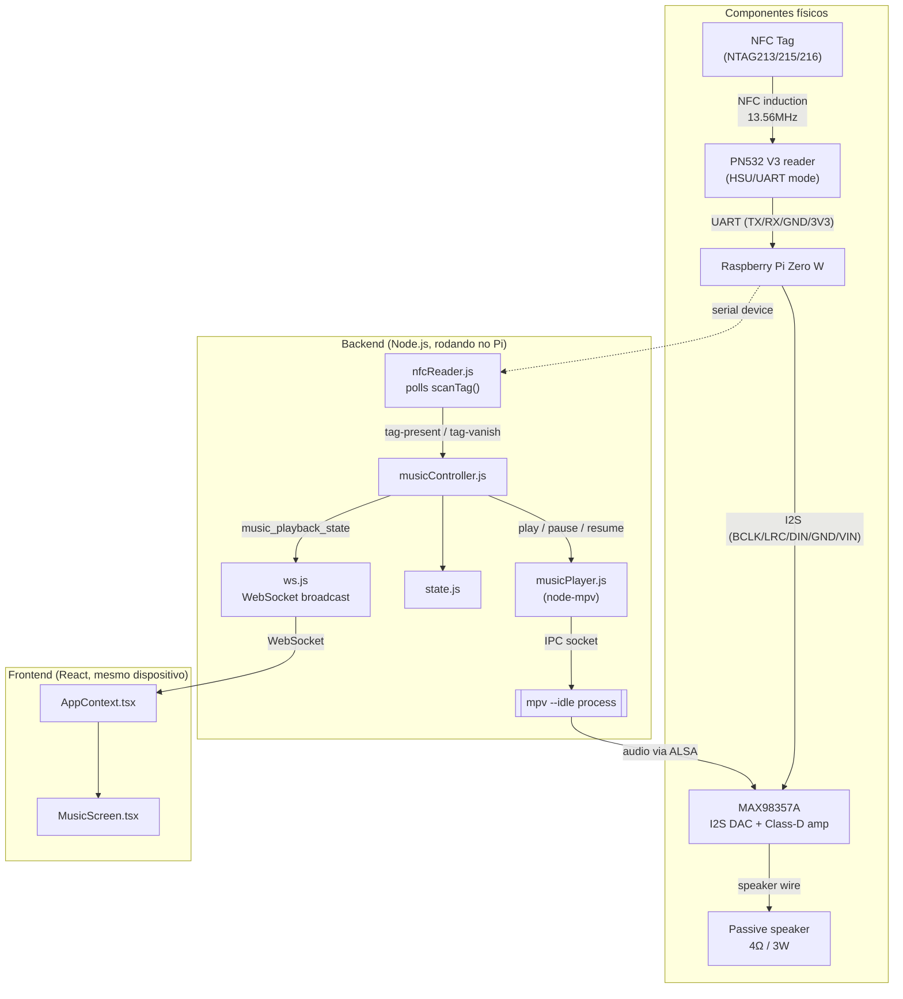

# Player de música ativado por tag NFC

## Contexto

O Alexo hoje já tem um pipeline NFC "acidental": um dispositivo externo (celular/app) faz `POST /api/nfc` com `{type, message}` e o backend retransmite via WebSocket para mostrar uma mensagem na tela por 10s. Essa feature é totalmente separada da nova: agora queremos um **leitor NFC físico ligado direto no Pi Zero W**, controlado pelo Node, que ao detectar uma tag toca uma música mapeada àquela tag (e pausa quando a tag é removida) — um efeito "caixinha tipo Tonie/Yoto". O hardware já foi decidido em conversa anterior:

- **Áudio**: MAX98357A (DAC I2S + ampli Classe D) + speaker passivo 4Ω/3W.
- **Leitura NFC**: módulo PN532 via **UART/serial** (biblioteca npm `pn532`, pacote `techniq/node-pn532`), usando `scanTag()` em polling — suporta **NTAG (203/213/215/216) e Mifare Ultralight**, mas explicitamente **não suporta Mifare Classic**. Essa lib tem suporte a I2C, mas está marcado como WIP há quase 10 anos sem retomada — por isso a escolha é UART, o caminho testado de verdade pela lib. Sem evento nativo de "tag removida": a detecção de presença/ausência é implementada por nós, comparando UID entre polls sucessivos.
- **Playback**: `mpv --idle` controlado via socket IPC JSON, usando o pacote `node-mpv`.
- **Gestão de conteúdo**: página admin HTML server-rendered (`/admin/music`), no mesmo molde da `/admin/gallery` que já existe.

Escopo v1: **1 tag = 1 álbum** — a tag aponta para uma *pasta* de faixas, não para um arquivo
(decidido em 24/08/2026, substitui o "1 tag = 1 música" original). O mpv toca a pasta em ordem
via `loadlist`, e `playlist-next`/`playlist-prev` passam a ser comandos IPC diretos. Isso resolve
uma pendência do escopo antigo: "pular" não tinha alvo e tinha virado "reiniciar a faixa atual"
na UI. Agora tem.

O custo da mudança é pequeno e está concentrado no player: `musicPlayer.js` ganha
`next()`/`previous()`, o estado ganha `trackIndex`/`trackCount`, e o cadastro deixa de ser
upload-por-faixa para virar upload-por-pasta. O ganho é no conteúdo: um álbum novo é uma pasta
nova e **um** mapeamento, em vez de N uploads e N mapeamentos.

Essas duas features NFC (mensagem via HTTP externo vs. música via leitor físico) devem ficar **completamente desacopladas** no backend e no frontend — mesma tecnologia de transporte (WebSocket), fluxos de estado independentes.

## Diagrama

Fluxo lógico (hardware físico + módulos de software):



### Fiação (pinout GPIO)

Conexões físicas no header de 40 pinos do Pi Zero W (os pinos de I2S e UART são fixos pelo SoC, não é escolha de projeto):

```
Raspberry Pi Zero W — GPIO header (40 pinos)
─────────────────────────────────────────────

PN532 V3 — header de 4 furos (chaves SW1=1, SW2=0 → modo I2C)  [CONFIRMADO FUNCIONANDO]
  Posição física nesta placa, confirmada por comportamento e não pelo silk:
  chave 1 para a DIREITA, chave 2 para a ESQUERDA.
  Esse header é dual-purpose: rótulos SDA/SCL impressos na frente (modo I2C),
  rótulos TXD/RXD impressos no verso da placa (modo HSU) — mesmos furos físicos.

    VCC             <──  3V3          (pin 1)
    GND             <──  GND          (pin 6)
    SDA             <──> GPIO15       (pin 10)
    SCL             <──> GPIO14       (pin 8)

  I2C por software (driver i2c-gpio) nesses pinos, em /dev/i2c-3 — o GPIO14/15 não
  tem função de I2C em hardware. Sem resistor em série e sem divisor: I2C é
  open-drain e, com VCC em 3,3V, nada no barramento passa de 3,3V.

  Header de 8 furos (SCK/MISO/MOSI/SS/VCC/GND/IRQ/RSTO) — usado só em modo SPI,
  sem uso no projeto (IRQ/RSTO não são necessários pro polling via scanTag()).

MAX98357A — I2S DAC + amplificador Classe D (7 pinos, na ordem física do módulo)

    LRC   <──  GPIO19     (pin 35)
    BCLK  <──  GPIO18     (pin 12)
    DIN   <──  GPIO21     (pin 40, "DOUT")
    GAIN        sem conexão (flutuando = ganho padrão de 9dB)
    SD          sem conexão (pull-up interno = ampli sempre ligado)
    GND   <──  GND        (pin 9)
    VIN   <──  5V         (pin 2)

    saída speaker+/speaker- ──► Passive speaker 4Ω / 3W

NFC tag (NTAG213/215/216) ──► sem fio, só aproximação 13.56MHz da antena do PN532
```

Notas:
- **Ressalva de UART**: no Pi Zero W, o Bluetooth ocupa o UART primário (PL011) por padrão, deixando só a mini-UART (`/dev/ttyS0`) exposta em GPIO14/15. Testar essa primeiro; se instável, adicionar `dtoverlay=disable-bt` em `/boot/config.txt` pra liberar o UART completo (ver seção de verificação abaixo).
- ~~**VCC do PN532 vai no 5V, não no 3V3.**~~ **Refutado em 23/08/2026**: funciona em 3,3V.
  O texto abaixo é o raciocínio da época, mantido só como histórico. Nota original:
  Esta nota já disse o contrário e estava errada —
  a versão anterior recomendava 3.3V "pra bater com o nível lógico do Pi", e essa é a causa
  provável do módulo nunca ter respondido (ver diagnóstico abaixo). Duas fontes independentes:
  a página do módulo diz *"On-board level shifter, Standard 5V TTL for I2C and UART, 3.3V TTL
  SPI"* — o shifter precisa do 5V como referência; e a doc da lib `pn532pi` diz *"The Raspberry
  Pi 3.3v regulator does not provide enough current to drive the PN532 chip. If you try to run
  the PN532 off your Raspberry Pi 3.3v it will reset randomly and may not respond to commands."*
  A segunda explica por que o LED do módulo fica aceso normalmente: a alimentação existe, e só
  colapsa quando o PN532 energiza o campo RF — exatamente quando precisaria responder.
- **Resistor de 1kΩ em série no TX do módulo** — ver subseção logo abaixo.
- **DIN do MAX98357A** se conecta ao **DOUT** de I2S do Pi (GPIO21) — o Pi transmite os dados de áudio, o DAC só recebe.

### Adaptação de nível no TX do PN532 (histórico — não se aplica mais)

> **Obsoleto.** Esta seção inteira parte de "o módulo precisa de 5V", que foi refutado:
> ele roda em 3,3V. Em I2C, que é a configuração adotada, não há adaptação de nível a
> fazer. Mantido porque a análise de divisor vs. resistor em série continua correta em
> si, e serve se algum dia o módulo precisar mesmo ir para 5V.


Consequência direta de alimentar o módulo em 5V: o `SDA`(=TXD) dele passa a sair em 5V, e
**nenhum GPIO do Raspberry Pi é tolerante a 5V**. As duas direções não são simétricas:

| Direção | Situação |
|---|---|
| Pi TXD 3,3V → módulo RXD (5V TTL) | **OK.** O limiar de entrada TTL é ~2,0V, então 3,3V é lido como nível alto |
| Módulo TXD 5V → Pi RXD (3,3V) | **Risco de dano.** É esta linha que precisa de adaptação |

#### Solução adotada: um resistor de 1kΩ em série

```
   módulo SDA(TXD) ──[ 1kΩ ]──► Pi pino 10
```

Só isso, nada para o GND. **Não é um divisor** — é um limitador de corrente, e foi escolhido
justamente por funcionar sem que se saiba a tensão real de saída do módulo:

| Saída real do módulo | Com 1kΩ em série | Resultado |
|---|---|---|
| 5V | corrente nos diodos de proteção do GPIO limitada a ~1,4mA | dentro do que eles suportam |
| 3,3V | sem queda (entrada CMOS não puxa corrente DC) | Pi recebe 3,3V limpos |

Como projeto formal é inferior a um divisor — ele se apoia nos diodos de clamp do GPIO em vez
de garantir o nível por construção. Mas é a única opção segura nos dois cenários, e a medição
que decidiria entre eles não foi possível (ver abaixo).

#### Por que NÃO usar o divisor 1k/2k aqui

Um divisor dimensionado para 5V→3,3V aplicado a um módulo que já sai em 3,3V entrega
**2,2V** ao Pi — perto demais do limiar de entrada, e a 115200 baud isso consome quase toda
a margem de ruído. Pode funcionar, pode dar erro intermitente.

Ou seja, o divisor **não é uma escolha neutra**: montá-lo "por precaução" cria um problema
diferente. Ele só é o certo depois de medir e confirmar 5V na saída. (Uma versão anterior
deste documento dizia que montar o divisor por precaução não custava nada — estava errado.)

#### A medição com multímetro e por que ela falhou

O plano era: com o módulo em 5V e o fio do TX **desconectado do Pi**, medir o `SDA` em
repouso. UART fica em nível alto quando ociosa, então a leitura seria o nível lógico alto do
módulo — ~3,3V dispensaria adaptação, ~5V exigiria o divisor.

Medido em 23/08/2026, com o `SDA` ainda ligado ao pino 10:

| Ponto | Leitura | Interpretação |
|---|---|---|
| `VCC` no módulo | ~3V | **confirma que o VCC ainda está no pino 1 (3V3)** — a mudança para 5V não tinha sido feita |
| `SDA` no módulo | ~3V | **inconclusivo** |

A segunda leitura não vale: o GPIO15 tem **pull-up interno para 3,3V**, então com o fio
conectado essa linha fica em ~3,3V por conta do próprio Pi, independentemente do que o
módulo faça. Mediu-se o pull-up do Pi, não a saída do módulo. Para uma leitura válida o fio
precisa estar solto — daí a escolha do resistor em série, que dispensa a medição.

#### Por que não basta trocar de GPIO

Pergunta que surgiu e vale registrar: mover o TX para outro pino **não resolve**, por duas
razões independentes.

1. Nenhum GPIO do Pi é tolerante a 5V — não é característica do pino 10, é de todos.
2. O RX da UART não é escolhível à vontade. O `/boot/overlays/README` mostra que existem
   alternativas (`rxd1_pin` aceita 15, 33 ou 41; `rxd0_pin` aceita 15, 33 ou 37), mas
   **GPIO 33, 37 e 41 não saem no header de 40 pinos** — ele expõe só até o GPIO 27. Na
   prática, GPIO15 (pino 10) é a única opção fisicamente alcançável.

#### Alternativa: SPI não precisa de adaptação

A página do módulo diz `3.3V TTL SPI` — em SPI os pinos já são 3,3V mesmo com VCC em 5V,
sem divisor e sem risco. O custo é trocar a chave DIP (`0 | 1`), usar o header de 8 furos, e
**depender de suporte a SPI na lib Node** — que é justamente o que nos levou a escolher UART.
Não é o plano atual, mas se o UART continuar problemático depois do 5V, é o caminho
eletricamente mais limpo e vale reavaliar a escolha da biblioteca nesse cenário.

## Áudio: configuração confirmada

Testado no Pi real em 23/08/2026 — som saiu pelo speaker, cadeia inteira validada
(I2S → MAX98357A → speaker, com decode de MP3).

Três linhas no `/boot/config.txt`, seguidas de reboot:

```
#dtparam=audio=on                     # desliga o snd_bcm2835 (HDMI), pro DAC virar card 0
dtparam=i2s=on
dtoverlay=max98357a,no-sdmode
```

Notas sobre cada uma:

- **`max98357a` em vez de `hifiberry-dac`**: o kernel do Pi (5.10.103+, Raspbian Buster)
  já traz o overlay específico do chip. O parâmetro `no-sdmode` é o que corresponde à
  nossa fiação — como o pino `SD` fica sem conexão (pull-up interno = ampli sempre
  ligado), o driver não deve tentar controlar esse pino. Sem `no-sdmode` ele assumiria
  o GPIO4 como controle de shutdown.
- **Desligar `dtparam=audio=on`** não é obrigatório, mas faz o DAC ser `card 0` e evita
  ter que selecionar placa em todo lugar. Reversível: é só descomentar. Perde-se áudio
  por HDMI, que nesse kiosk não é usado.

Resultado: `card 0: MAX98357A [MAX98357A], device 0` → device ALSA **`hw:0,0`**,
ou seja `--audio-device=alsa/hw:0,0` no `musicPlayer.js`.

### Volume é obrigatoriamente por software

`amixer -c 0 scontrols` retorna **vazio** — o MAX98357A não tem nenhum controle de
volume por hardware, e sem o `snd_bcm2835` não há mixer nenhum no sistema. Não é
limitação de configuração, é o chip: ele é um DAC + ampli de ganho fixo (o pino
`GAIN` flutuando = 9dB).

Consequência pro projeto: o `setVolume` do `musicPlayer.js` é a **única** forma de
controlar volume, via volume por software do mpv. Não existe fallback de `amixer`.

**Volume padrão: 100** (máximo). Lembrando que a escala do mpv é atenuação: `100` é ganho
unitário, ou seja, o arquivo sai sem alteração — nada é amplificado por software, e acima
disso só com `--volume-max`, que aí sim ampli­fica e clipa.

Como se chegou nesse número:

| Volume | Resultado |
|---|---|
| 30 | limpo, mas baixo demais |
| 45 | melhor, ainda baixo na prática |
| 60 | audível, com distorção perceptível |
| 100 | **escolhido** — o speaker do projeto é ineficiente e volume audível importou mais que fidelidade |

Decisão do usuário, com a contrapartida conhecida: a 60 já havia distorção, então a 100 ela
é maior. Não é clipping de software (100 é unitário) — é o estágio analógico. A correção
real está na pendência abaixo, não em mexer no volume.

#### Pendência: distorção em volume alto

A partir de ~60 o som distorce. **Subtensão foi descartada** — `vcgencmd get_throttled`
retorna `0x0`, e esse bit é persistente desde o boot, então teria registrado se a fonte
tivesse afundado durante os testes altos. Também não é clipping de software, já que 60 é
atenuação, não amplificação.

A hipótese que sobra é o **ganho analógico fixo do MAX98357A**: com o pino `GAIN`
flutuando ele aplica 9dB, e trilhas de jogo são masterizadas quente — 9dB em cima disso
empurra o speaker de 3W além da excursão do cone.

Caminho quando for retomar: com o volume digital já no máximo, não há mais folga por
software — a única saída é o hardware. Se o problema for volume insuficiente, **subir** o
ganho (`GAIN` no `GND` = 12dB, ou 100kΩ ao `GND` = 15dB). Se for distorção, **baixar**
(`GAIN` no `VIN` = 6dB) e aceitar menos volume, ou trocar por um speaker mais eficiente.
Soa mais alto *e* mais limpo, e ainda melhora a relação sinal-ruído, porque menos
atenuação digital deixa mais resolução. Tabela do pino:

| Ligação do pino GAIN | Ganho |
|---|---|
| 100kΩ para o GND | 15 dB |
| direto no GND | 12 dB |
| flutuando (atual) | 9 dB |
| direto no VIN | 6 dB |
| 100kΩ para o VIN | 3 dB |

Se depois de baixar o ganho ainda distorcer, o próximo teste é uma senoide via
`speaker-test`, que tira o MP3 da equação: senoide limpa + música distorcida aponta para
o material de origem, não para o hardware.

Deliberadamente **não** configuramos um plugin `softvol` do ALSA: criaria um segundo
lugar para ajustar a mesma coisa, com risco de multiplicar dois atenuadores sem
perceber. O volume é comportamento da aplicação.

### mpv: instalado e validado via IPC

`mpv 0.29.1` instalado no Pi em 23/08/2026, e o controle por socket IPC — que é a base do
`musicPlayer.js` — foi validado ponta a ponta contra uma faixa real:

| Comando IPC | Resultado |
|---|---|
| `loadfile <path>` | success, áudio tocando |
| `get_property duration` | `17.502041` |
| `get_property volume` | `30.0` |
| `set_property pause true` | posição **congelada** em `5.299909` por 2s |
| `set_property pause false` | retomou, avançou para `8.70517` |

O pause/resume preservando a posição é exatamente o mecanismo de que a regra
"mesma tag recolocada → retoma de onde parou" depende. Está provado no hardware.

Linha de comando validada:

```
mpv --idle=yes --no-video --audio-device=alsa/hw:0,0 --volume=30 \
    --input-ipc-server=/tmp/mpvsocket
```

#### Comandos manuais para testar áudio no Pi

Úteis para reproduzir som sem nenhum código do projeto rodando. Todos verificados no Pi.

**Subir o mpv ocioso** (uma vez; depois cada reprodução é instantânea):

```bash
setsid nohup mpv --idle=yes --no-video --audio-device=alsa/hw:0,0 --volume=100 \
  --input-ipc-server=/tmp/mpvsocket >/tmp/mpv.log 2>&1 </dev/null &
```

Lembrar dos ~11s até o socket aparecer. Esperar por ele:
`for i in $(seq 1 60); do [ -S /tmp/mpvsocket ] && break; sleep 0.5; done`

**Tocar** (o `socat` não está instalado; o `nc -U` está e funciona):

```bash
printf '{"command":["loadfile","/caminho/arquivo.mp3"]}\n' | nc -U -q1 /tmp/mpvsocket
```

Demais comandos, mesmo formato — a resposta vem como `{"data":...,"error":"success"}`:

| Ação | JSON |
|---|---|
| pausar | `{"command":["set_property","pause",true]}` |
| retomar | `{"command":["set_property","pause",false]}` |
| parar | `{"command":["stop"]}` |
| volume | `{"command":["set_property","volume",100]}` |
| posição | `{"command":["get_property","time-pos"]}` |
| duração | `{"command":["get_property","duration"]}` |

Para sequências com temporização (tocar N segundos e parar), o `nc` fica desajeitado porque
cada invocação abre e fecha a conexão. Nesses casos vale um Python inline, que mantém o
socket aberto:

```bash
python3 - <<'SCRIPT'
import socket, json, time
s = socket.socket(socket.AF_UNIX, socket.SOCK_STREAM); s.connect("/tmp/mpvsocket")
def cmd(*a):
    s.sendall((json.dumps({"command": list(a)}) + "\n").encode()); time.sleep(0.3)
cmd("loadfile", "/caminho/arquivo.mp3")
time.sleep(20)
cmd("stop")
SCRIPT
```

**Sem mpv ocioso**, para um teste solto — mais simples, mas paga os ~11s de startup:

```bash
mpv --no-video --audio-device=alsa/hw:0,0 --volume=100 "/caminho/arquivo.mp3"
```

Acrescentar `--length=20` para limitar a duração.

#### Instância órfã de mpv: matar antes de subir a própria

Um mpv ocioso consome **~43MB RSS (9,7%)** nesse Pi, que tem 430MB no total. CPU ocioso é
desprezível, e ele **não segura o dispositivo de áudio** (`fuser /dev/snd/*` mostra só
`alsactl` e `pulseaudio`), então não bloqueia outros players. Também não sobrevive a reboot,
por não ser serviço.

Consequência prática: durante os testes manuais ficou um mpv rodando solto no Pi. Quando o
`musicPlayer.js` entrar em cena ele vai subir o próprio, e dois processos custam ~86MB —
significativo num aparelho desse tamanho. Pior, se ambos usarem o mesmo caminho de socket,
o segundo falha ao criar o `/tmp/mpvsocket`.

Duas medidas no `musicPlayer.init()`:

- **Usar um caminho de socket próprio do projeto** (ex.: `/tmp/alexo-mpv.sock`) em vez do
  `/tmp/mpvsocket` genérico usado nos testes manuais — evita colisão por acidente.
- **Derrubar instâncias órfãs no boot** antes de subir a sua. Cuidado com o padrão do
  `pkill`: `pkill -f "input-ipc-server"` casa com o próprio processo que o executa se a
  string estiver na linha de comando dele (aconteceu aqui, matou a sessão ssh). Usar
  `pkill -x mpv` ou casar pelo caminho do socket do projeto.

**Regra geral, porque isso já mordeu três vezes neste projeto** (`node server.js`, `mpv`, e os
scripts de teste do NFC em 24/08): `pkill -f` e `pgrep -f` casam contra a linha de comando
*inteira* de todo processo, inclusive a do shell que os está executando. Num `ssh host 'pkill -f
foo'`, a linha do shell remoto contém `foo` — ele mata a si mesmo e o comando volta com erro
enigmático. Três saídas, em ordem de preferência:

1. **Matar por PID**, obtido antes (`$!` do próprio launch, ou pela porta:
   `ss -lptn 'sport = :3001' | grep -oP 'pid=\K[0-9]+'`).
2. **`pkill -x <nome-exato>`**, que casa só o executável e ignora argumentos.
3. **Quebrar o auto-match com colchete** (`pkill -f 'fo[o]'`) — mas só funciona se a string
   literal não aparecer em nenhum outro ponto do mesmo comando, o que é fácil de errar.

#### PulseAudio também está no Pi

`pulseaudio` roda nesse Pi e segura o `/dev/snd/controlC0`. Todos os testes passaram por cima
dele com `--audio-device=alsa/hw:0,0`, indo direto ao ALSA, e funcionaram. Fica registrado
porque existe uma segunda camada de áudio no caminho: se em algum momento o som sumir sem
explicação aparente, ou o volume se comportar de forma estranha, o Pulse é o primeiro
suspeito — e a saída é continuar endereçando o ALSA diretamente, como já fazemos.

#### ⚠ O mpv leva ~11s para subir nesse Pi

Medido: o socket IPC só aparece **11 segundos** depois de lançar o processo, com a CPU a
~50% durante a inicialização. Isso é com o cache de fontes já quente — na primeira
execução foi entre 10 e 20s. **Não é custo único, é toda vez.**

Três consequências de projeto:

1. **Confirma a decisão de subir o mpv com `--idle` no boot do backend.** Lançar o mpv sob
   demanda, na primeira tag, colocaria 11s de silêncio entre encostar a tag e ouvir som —
   inaceitável para o efeito "caixinha". O processo tem que já estar de pé, ocioso.
2. **`musicPlayer.init()` não pode assumir que o socket existe logo após o spawn.** Precisa
   esperar o socket aparecer, com timeout generoso (≥30s), e o boot do Express **não pode
   bloquear** nisso — inicialização assíncrona, e o backend sobe normalmente enquanto o mpv
   ainda está subindo.
3. **Verificar o timeout de conexão do `node-mpv`.** A lib espera o socket por conta
   própria; se o default dela for menor que ~15s, vai falhar por pouco nesse hardware.
   Conferir e aumentar explicitamente ao configurar.

### Pendência do ambiente: apt do Pi estava quebrado

O Raspbian Buster saiu do arquivo principal — `raspbian.raspberrypi.org` devolve 404 e
qualquer `apt install` falhava. Corrigido repontando o `/etc/apt/sources.list` para o
arquivo oficial de versões EOL (backup em `/etc/apt/sources.list.bak`):

```
deb http://legacy.raspbian.org/raspbian/ buster main contrib non-free rpi
```

Fica registrado porque afeta qualquer instalação futura nesse Pi, não só o mpv. O
`archive.raspberrypi.org/debian buster` (repo da Foundation) continua funcionando e não
foi tocado. Cuidado ao instalar coisas aqui: a imagem é antiga e a orientação do usuário é
mexer o mínimo — usar `apt-get install -s` (simulação) antes e conferir que o resumo diz
`0 upgraded, 0 to remove`, nunca rodar `apt upgrade`.

## NFC: resolvido em 23/08/2026 — o módulo funciona em I2C

> **RESOLVIDO.** O PN532 lê tags de forma confiável em I2C, alimentado em 3,3V, nos mesmos
> pinos que já estavam soldados. O que segue nesta seção é o histórico da investigação do
> HSU, mantido porque explica de onde vêm as decisões — mas as conclusões elétricas dele
> (precisa de 5V, precisa de resistor em série) foram **refutadas na prática**. Pule para
> "Pivô para I2C".

Histórico. O módulo **não respondia** em HSU. Zero bytes de retorno. Estado da investigação
naquele momento:

**Descartado — o lado do Pi está inteiramente sadio:**

- `/dev/serial0 → ttyS0` existe (exigiu `enable_uart=1` e remover `console=serial0,115200`
  do `cmdline.txt`, ambos já feitos)
- `raspi-gpio get 14,15` → `alt=5 func=TXD1` / `func=RXD1` — os pinos estão muxados na
  mini-UART
- nenhum processo segurando a porta (`fuser`), usuário no grupo `dialout`
- os frames saem corretos na linha: `00 00 ff 02 fe d4 02 2a 00` é o `GetFirmwareVersion`
  canônico, conferido byte a byte
- **duas implementações independentes** (o smoke test em Node e um probe em Python puro
  com `termios`) recebem zero bytes. Não é bug de código nem falta de biblioteca.

**Causa provável: VCC em 3.3V.** Ver as notas da seção de fiação — duas fontes
independentes dizem que o PN532 precisa de 5V, e a doc da `pn532pi` descreve o sintoma
exato ("may not respond to commands"). O LED aceso não descarta isso: a alimentação
colapsa só quando o chip energiza o campo RF.

**Próximos passos, em ordem:**

> **Superado pelo pivô para I2C** (subseção logo abaixo). A lista abaixo é o caminho
> HSU e continua válida como plano B, mas depende de solda e de adaptação de nível —
> o caminho I2C testa a mesma hipótese sem nenhum dos dois. Fazer o I2C primeiro.

1. Conferir a chave DIP em HSU (`0 | 0` nessa placa) — custo zero, só olhar.
2. Mover VCC do pino 1 (3V3) para o pino 2 (5V) e colocar **1kΩ em série** na linha do
   `SDA` → pino 10 — ver "Adaptação de nível no TX do PN532". Confirmado por medição em
   23/08/2026 que o VCC ainda estava no 3V3, ou seja, este passo não tinha sido feito.
3. Se ainda mudo, o loopback isola de vez: tirar os dois fios de dados e jumpear o pino 8
   no pino 10 do Pi. Rodar `node backend/scripts/pn532-smoke-test.js --verbose` — se
   aparecerem linhas `<--` (o próprio comando ecoado, terminando em
   `TFI inesperado na resposta: 0xd4`), a UART do Pi está perfeita e o defeito é do módulo.

**Nota sobre a `pn532pi`:** é uma lib Python, não serve pro projeto (que é Node), mas a
documentação dela é a melhor referência de hardware que encontramos até agora. Vale
consultar antes de qualquer nova hipótese elétrica.

### Pivô para I2C (23/08/2026)

Motivado por [este tutorial](https://www.electroniclinic.com/raspberry-pi-pico-and-pn532-nfc-rfid-module-using-arduino-ide/)
de PN532 + Raspberry Pi Pico. Ele é apresentado como "o mesmo design, mas em SPI" — não é:
**o tutorial é I2C**, a única menção a SPI é de passagem ("It doesn't matter if you start
with HSU, I2C, or SPI"), e todo o código é `PN532_I2C pn532_i2c(Wire)`. A fiação dele é
VCC em **3.3V**, SDA/SCL nos GPIOs de I2C, chave DIP com canal 1 ON e canal 2 OFF (= `1 | 0`).

Isso é melhor notícia do que SPI seria, por três motivos independentes.

**1. Não exige solda nenhuma.** O header de 4 furos é dual-purpose: o furo rotulado `SDA`
na frente é o mesmo furo rotulado `TXD` no verso, e idem `SCL`/`RXD`. As juntas de solda
que já existem no módulo servem para I2C sem serem tocadas. Só muda a ponta que está no
header do Pi — dois jumpers que saem dos pinos 8/10 e entram nos pinos 5/3 — e a chave DIP.
Isso destrava o teste sem esperar o estanho.

**2. Elimina a questão do nível lógico, em vez de contorná-la.** I2C é *open-drain*: nenhum
dos lados dirige a linha para nível alto, os dois só puxam para o terra, e quem sobe a linha
é um pull-up. O Pi tem pull-ups fixos de 1,8kΩ para 3,3V soldados no GPIO2/GPIO3 — dá pra
confirmar sem instrumento nenhum:

```
$ raspi-gpio get 2,3        # com nada conectado
GPIO 2: level=1 fsel=0 func=INPUT
GPIO 3: level=1 fsel=0 func=INPUT
```

`level=1` em pino de entrada flutuante é o pull-up se revelando. Com VCC em 3,3V, nada no
barramento pode ultrapassar 3,3V, então o resistor de 1kΩ em série (e todo o raciocínio da
seção "Adaptação de nível no TX do PN532") simplesmente deixa de ser necessário.

> ⚠ Isso vale **só com VCC em 3,3V**. Em I2C com VCC em 5V o shifter do módulo passa a puxar
> as linhas para 5V, brigando com o pull-up de 3,3V do Pi e injetando corrente nos diodos de
> proteção do SoC. Se um dia formos para 5V em I2C, aí sim é preciso um level shifter
> bidirecional de verdade (BSS138). Em I2C: 3,3V, ponto.

**3. Dá um teste de presença que o HSU nunca deu.** É o ganho mais importante. Uma UART é
muda por natureza: "zero bytes" não distingue módulo morto, fio trocado, chave DIP errada
ou porta mal configurada — foi exatamente onde o diagnóstico empacou. Em I2C o escravo
confirma o próprio endereço **por hardware**, antes de qualquer byte de protocolo. Então:

| Resultado | Conclusão |
|---|---|
| `i2cdetect -y 1` mostra `0x24` | o módulo está vivo e alimentado; o que falhar daí pra frente é protocolo/software |
| tabela vazia, ou `errno 121` (EREMOTEIO) | não há ACK de endereço — o problema é elétrico (alimentação, fio, chave DIP) |

Uma resposta binária em um segundo, contra a ambiguidade que arrastamos no UART.

**Sobre o 5V.** O tutorial roda em 3,3V e funciona, o que é evidência contra a hipótese de
que 3,3V é insuficiente (a citação da `pn532pi`). Não resolve a questão — é outra placa e
outro regulador —, mas como em I2C o teste a 3,3V é gratuito e sem risco, é por onde começar.
Se o `0x24` não aparecer a 3,3V, aí a hipótese do 5V volta com força, e o custo dela em I2C
é o level shifter do aviso acima.

#### O que de fato funcionou: `i2c-gpio` nos pinos que já estavam soldados

A proposta inicial desta seção era mover `SDA` para o pino 3 e `SCL` para o pino 5, "sem
precisar de solda". **Isso estava errado para este build.** O módulo está soldado direto no
header do Pi, sem protoboard e sem jumper — as duas pontas de cada fio são juntas de solda.
Mover para os pinos 3/5 exigiria dessoldar, ou seja, exatamente o que estava bloqueado.

A saída foi não mover nada. O Linux tem o driver `i2c-gpio`, que faz I2C por software
(bit-banging) em **qualquer** par de GPIOs. O BCM2835 não oferece função de I2C em hardware
no GPIO14/15 — nenhum modo ALT desses pinos é I2C —, mas por software isso deixa de importar.
O barramento nasceu em cima da fiação existente:

```
PN532 V3 — fiação inalterada, só a chave DIP mudou para I2C (1 | 0)

    VCC             <──  3V3          (pin 1)   ← 3,3V basta; ver refutação abaixo
    GND             <──  GND          (pin 6)
    SDA             <──> GPIO15       (pin 10)  ← mesma solda, agora falando I2C
    SCL             <──> GPIO14       (pin 8)   ← mesma solda, agora falando I2C
```

Sem resistor em série, sem divisor, sem dessoldar. Configuração:

```bash
# runtime, sem reboot
sudo dtoverlay i2c-gpio i2c_gpio_sda=15 i2c_gpio_scl=14 bus=3

# persistente, em /boot/config.txt (backup: config.txt.bak-pre-i2cgpio)
dtoverlay=i2c-gpio,i2c_gpio_sda=15,i2c_gpio_scl=14,bus=3
```

O barramento de hardware (`/dev/i2c-1`, GPIO2/3) continua habilitado e não é usado pelo
PN532 — fica disponível para outros periféricos. O PN532 está no **`/dev/i2c-3`**, e todo
comando precisa de `--bus 3`. O `enable_uart=1` continua no `config.txt` sem causar
conflito: o overlay tomou os pinos do ALT5 sem reclamar, tanto em runtime quanto no boot.

#### Resultado

```
$ i2cdetect -y 3
20: -- -- -- -- 24 -- -- -- -- -- -- -- -- -- -- --

$ python3 backend/scripts/pn532-i2c-probe.py --bus 3
OK  o módulo respondeu — IC 0x32, firmware 1.6
    suporta: ISO14443A, ISO14443B, ISO18092
OK  configurado — pronto pra ler tags
    tag presente  UID 693B9D29  (4 bytes)  →  Mifare Classic 1K
    tag removida  693B9D29
OK  11 leitura(s) de tag. O hardware NFC está funcionando.
```

Onze ciclos de presença/remoção, UID estável, tipo consistente.

**Causa raiz do silêncio no HSU: indeterminada.** A chave DIP não tinha sido verificada
visualmente durante os testes de UART (era o passo 1 da lista "próximos passos", nunca
executado) e desde então foi movida para `1 | 0`. Se ela estivesse em I2C naquele período,
explica tudo sozinha — o módulo ignoraria a serial por design. Não dá para provar
retroativamente, e não vale desfazer uma configuração que funciona só para descobrir.

**Duas hipóteses refutadas na prática:**

| Hipótese | Veredito |
|---|---|
| O PN532 precisa de 5V; o regulador 3,3V do Pi não dá conta (`pn532pi`) | **Falsa para esta placa.** Roda em 3,3V respondendo a todos os comandos e energizando o campo RF |
| O TX do módulo precisa de 1kΩ em série para não danificar o GPIO | **Desnecessária.** Nunca foi instalado. Em open-drain a 3,3V o problema não existe |

Ambas custaram tempo. A lição prática: o `i2cdetect` teria dado uma resposta binária no
primeiro dia, e a escolha do HSU nos privou desse sinal durante toda a investigação.

#### Sobre o tipo da tag: Mifare Classic 1K

O SAK `0x08` identifica Mifare Classic 1K. Historicamente isso era um divisor de águas na
escolha de biblioteca (a lib UART suporta NTAG e não Classic; a I2C, o contrário), **mas
para este projeto é irrelevante**: o design mapeia UID → faixa, e o UID vem do
`InListPassiveTarget`, que é parte do ISO14443A e funciona igual para qualquer tag dessa
família. Ler *memória* da tag é que exigiria autenticação e aí o tipo importaria — não é o
caso. Qualquer tag ISO14443A serve, Classic ou NTAG.

#### O PN532 também grava — e por que mesmo assim o mapeamento fica em JSON

Levantado em 24/08/2026: já que o módulo escreve, dava para gravar o álbum na própria tag e
dispensar o mapeamento. **Escreve mesmo** — o PN532 é leitor e gravador ISO14443A, e a escrita
sai pelo `InDataExchange` (0x40), o mesmo caminho do `InListPassiveTarget` que já funciona.

O custo depende do tipo da tag, e aqui o tipo **volta a importar** (ao contrário da leitura de
UID, onde não importava — ver a seção acima):

| Tag | Como grava | Esforço |
|---|---|---|
| NTAG215 (as que o usuário já tem) | `WRITE` (0xA2), 4 bytes por página, 504 bytes de memória de usuário, **sem autenticação** | baixo |
| Mifare Classic 1K (o S50 do kit) | `MifareAuthent` (0x60/0x61) por setor antes de cada acesso, blocos de 16 bytes, chave padrão `FFFFFFFFFFFF` | médio, e com o risco de corromper o *sector trailer* e inutilizar o setor |

**Decisão: o mapeamento UID → pasta continua em `data/nfc-tags.json`.** O motivo não é
dificuldade técnica. É que gravar pelo Pi não elimina passo físico nenhum: o leitor está dentro
da caixa, então gravar exige encostar a tag no kiosk — exatamente o mesmo gesto que cadastrar.
E cadastrar escolhendo numa lista de pastas que o backend já conhece não tem como errar o nome,
enquanto um valor gravado na tag pode ficar órfão se a pasta for renomeada depois (e só se
conserta com a tag na mão).

Foi considerada uma exceção — gravar NDEF pelo celular, com um app grátis tipo NFC Tools, o que
permitiria preparar um lote de tags longe do Pi. **Descartada em 24/08/2026.** O argumento que
fechou a questão não foi o esforço, foi a duplicação de estado:

O leitor precisa **cair pra trás no UID** quando a tag vier vazia ou ilegível. Ou seja, o
mapeamento em JSON existe de qualquer jeito. Gravar na tag portanto não *substitui* o
mapeamento — cria uma segunda cópia do mesmo fato, que pode divergir da primeira sem nenhuma
regra óbvia de qual vence. Uma fonte da verdade, em `data/nfc-tags.json`, e ponto.

Consequência prática para a implementação: **o `nfcReader.js` só lê UID.** Nada de
`InDataExchange`, nada de autenticação Mifare, nada de parser NDEF. O tipo da tag volta a ser
irrelevante, como na seção anterior.

#### Detalhe de protocolo: abortar o comando pendente

Quando o `InListPassiveTarget` expira sem achar tag, o comando **continua rodando no chip**.
O manual do PN532 define que o host cancela mandando um frame de ACK. Sem isso, o próximo
comando chega em cima do anterior e as respostas saem trocadas — a detecção fica
intermitente de um jeito que parece problema elétrico. O `pn532-i2c-probe.py` faz esse
abort (`PN532I2C.abort()`), e qualquer implementação no backend precisa fazer o mesmo.

#### `nfcReader.js`: implementado e validado no Pi (24/08/2026)

Porte para Node do `pn532-i2c-probe.py`. `i2c-bus@5.2.3` compilou no `backend/` do Pi em
**3m23s** e virou dependência do `package.json`. O `require('i2c-bus')` fica **dentro** do
`init()`, de propósito: é addon nativo, a compilação no ARMv6 é o passo mais frágil do deploy,
e um require no topo do arquivo derrubaria o servidor inteiro se faltasse. Na máquina de dev,
sem o addon, o `init()` loga uma linha e devolve `false`.

Validado com `nfc-node-vs-python.sh` (ver abaixo): tag `04426A126F6180` lida em 90ms, com
detecção de presença e remoção.

**Dois defeitos corrigidos durante a validação**, ambos encontrados por teste e nenhum por
leitura do código:

| Defeito | Correção |
|---|---|
| `stop()` fechava o barramento por baixo da varredura em voo → `EBADF` falso no shutdown | guarda a promise do loop e espera ela terminar antes de fechar |
| Varredura vazia — o caso **normal** de um leitor ocioso — era contada como falha de barramento, e logaria "problema" a ~1 linha/segundo para sempre | `sendCommand` passou a classificar a falha em `timeout` / `bus` / `protocol`; só as duas últimas contam |

Um terceiro tipo de erro apareceu, mas nas *ferramentas de teste*, não no módulo: `pkill -f` e
`pgrep -f` casando com o próprio shell remoto que os invocava, e `require('./nfcReader')` num
script em `/tmp` resolvendo pela pasta do script em vez do cwd. Os dois primeiros testes nunca
chegaram a rodar por causa disso, e o silêncio deles foi lido como "não detectou tag". A
armadilha do `-f` já estava documentada neste plano para o `mpv` e ainda assim se repetiu — ver
a seção de armadilhas.

#### Ferramentas de bancada e por que são três

- **`pn532-i2c-probe.py`** — diagnóstico completo, sem dependências. Prova o *hardware*.
- **`nfc-read-uid.py`** — imprime só o UID, uma linha por tag. Para teste manual: descobrir o
  UID de uma tag nova e testar alcance/posicionamento sem ruído.
- **`nfc-reader-test.js`** — exercita o `nfcReader.js` de verdade. Prova o *porte*.
- **`nfc-node-vs-python.sh`** — roda os dois últimos na mesma sessão com a mesma tag parada.

O `.sh` existe por causa de uma ambiguidade de diagnóstico que custou várias rodadas: quando o
Node não lê nada, isso tanto pode ser bug no porte quanto tag fora do campo, e rodar os dois
separadamente **não** resolve, porque a posição da tag muda entre as tentativas. A solução foi
tirar o timing da equação: a fase 1 fica esperando até o Python ver a tag, e só então o Node
roda, com a tag imóvel. Aí o resultado é inequívoco.

#### O `i2cdetect` não prova que a antena funciona

Lição que custou caro em 24/08/2026. `i2cdetect -y 3` mostrando `0x24` prova apenas que o chip
dá ACK no próprio endereço — o campo RF é outro subsistema. Passamos várias rodadas de teste
com o módulo respondendo a `GetFirmwareVersion` e `SAMConfiguration` normalmente, e **zero**
leituras de tag, porque o módulo estava mal posicionado. O sintoma imita perfeitamente um bug de
software: `InListPassiveTarget` volta sem frame de resposta, exatamente como voltaria se o
comando estivesse malformado.

**Ao investigar "não lê tag", confirmar o campo RF antes de suspeitar do código** — rodar o
`nfc-read-uid.py` na mão e ver um UID aparecer.

#### Pendente: dropout com a tag parada

No teste de validação, com a tag **imóvel** na antena, o leitor a perdeu por ~4s e reencontrou:

```
 0.90s  PRESENTE  04426A126F6180
 5.07s  REMOVIDA  04426A126F6180   <- tag parada
 9.14s  PRESENTE  04426A126F6180
```

Acoplamento marginal. Importa para a música: um `tag-vanish` falso pausa a faixa e o
`tag-present` seguinte manda continuar, então o usuário ouviria um buraco de ~4s. O
`VANISH_CONFIRMATIONS = 2` atual (~2s de tolerância) não cobre isso.

**Não resolver só aumentando o número.** Cobrir 4s exigiria ~5 confirmações, e isso viraria ~5s
entre tirar a tag e a música pausar — péssimo para o gesto "tirei a tag, parou". O dropout é
sintoma de posicionamento, e a correção primária é física: fixar o módulo numa posição boa e
remedir. Só depois ajustar a tolerância, com o número justificado pela medição.

#### Escolha de biblioteca: cliente próprio sobre `i2c-bus`

Decidido depois de testar as opções no Pi real, não por leitura de README.

**`i2c-bus` compila e funciona.** Era o maior risco (addon nativo em ARMv6/Node 14) e está
descartado: `i2c-bus@5.2.3` compilou em **3m13s** e conversou com o módulo a partir do Node,
retornando `IC 0x32, firmware 1.6`. Isso elimina a necessidade de um sidecar em Python — o
backend pode ser dono do leitor.

**`pn532-i2c@2.0.0` está descartada, por dois motivos independentes:**

1. *Não carrega.* `src/i2c/commands/Command.js` linha 1 é `import { ERRORS } from
   "../constants";`, sem o `.js`. O resolvedor de ESM do Node exige extensão explícita, então
   o pacote morre com `ERR_MODULE_NOT_FOUND` no `import`. Todos os outros arquivos do pacote
   usam `.js` — é um deslize único, do tipo que só passa quando se testa via bundler.
   Contornar exigiria patch em `node_modules` ou fork.
2. *Incompatibilidade de módulo.* O pacote é ESM puro (`"type": "module"`); o backend é
   `"type": "commonjs"` e usa `require()` em tudo. CJS não consegue `require()` um ESM —
   precisaria de `import()` dinâmico, que contamina a inicialização com async à toa.

A lib tem coisas boas — expõe `bus` configurável (`new PN532({ i2c: { bus: 3 } })`) e emite
`tag`/`vanish`, que é exatamente o par de eventos que o `nfcReader.js` precisa. Vale
reavaliar se algum dia ela for corrigida.

**Decisão: `backend/nfcReader.js` fala `i2c-bus` diretamente.** O projeto precisa de três
comandos (`GetFirmwareVersion`, `SAMConfiguration`, `InListPassiveTarget`) e de comparar UIDs
entre polls. Já existe código de referência funcionando para tudo isso — o
`pn532-i2c-probe.py` e o teste em Node — incluindo o detalhe não-óbvio do abort por ACK.
São ~150 linhas sem atrito de ESM/CJS, e mantém a contagem de dependências baixa num Pi Zero.

O contrato do módulo não muda em relação ao que o plano já previa: `init()` em `try/catch`
(se `/dev/i2c-3` não existir, loga e segue — é o que permite rodar o backend na máquina de
dev), e eventos `'tag-present'`/`'tag-vanish'` com o UID normalizado.

**Implicação no deploy:** `i2c-bus` entra no `backend/package.json`, então o
`npm install --production` do `scripts/deploy.sh` vai compilá-lo no Pi. O primeiro deploy
depois disso leva ~3min a mais. Os seguintes reaproveitam o build.

**Configuração de runtime:** o barramento é o **3** (`/dev/i2c-3`), não o 1. Vale expor como
variável de ambiente em vez de constante — a máquina de dev não tem barramento nenhum, e um
Pi diferente pode numerar diferente.

## Bug pré-existente a corrigir como pré-requisito (RESOLVIDO em 23/08/2026)

`frontend/src/contexts/AppContext.tsx:92-94` trata **qualquer** broadcast do WebSocket como se fosse uma `NFCMessage` (`setCurrentMessage(message)` sem checar `type`), incluindo o já existente `{type:'gallery_updated'}`, que não tem `message`/`timestamp`. Isso nunca explodiu na prática porque a Galeria faz polling e não escuta o WS — mas qualquer broadcast novo (como `music_playback_state`) vai colidir com o fluxo de interrupção de `/message` se isso não for corrigido primeiro.

## Backend

### Novos módulos (mesmo estilo de `backend/ws.js`/`backend/state.js` — arquivos pequenos e focados)

- **`backend/nfcReader.js`**: só cuida do hardware. `init()` abre a porta serial (`serialport` + `pn532`) dentro de `try/catch` — se a porta não existir (ex.: rodando num Mac/dev sem o UART), loga aviso e não faz nada, sem derrubar o servidor. Faz um `setInterval` curto (~300ms) chamando `rfid.scanTag()`; compara o UID retornado com o último UID visto: UID novo → emite `'tag-present'`; UID que sumiu (poll retorna sem tag) → emite `'tag-vanish'`. Essa lógica de presença/ausência é nossa, já que a lib não expõe um evento `vanish` pronto (diferente do que a `pn532-i2c` oferecia).
- **`backend/musicPlayer.js`**: só cuida do mpv. `init()` sobe `mpv --idle --input-ipc-server=<path>` via `node-mpv`. Métodos `playAlbum(tracks)`, `pause()`, `resume()`, `restart()`, `next()`, `previous()`, `setVolume(v)`, `getStatus()`. `playAlbum` monta a playlist no mpv (`loadfile` da primeira + `append` do resto) e o mpv cuida do avanço entre faixas sozinho. Emite `'status'` com `{album, trackId, trackIndex, trackCount, title, filename, isPlaying, position, duration, volume}` a cada mudança real reportada pelo mpv (play/pause/troca de faixa/fim da playlist/seek).
- **`backend/musicController.js`**: a cola — é o único módulo que enxerga `state`, `wsServer`, `musicPlayer` e `nfcReader` ao mesmo tempo. Regra combinada com o usuário: **mesma tag recolocada → retoma de onde parou (pause/resume)**; **tag diferente colocada → reinicia do zero**, mesmo que por acaso aponte pra mesma faixa.
  - `tag-present(uid)` → busca `state.getTagMapping(uid)`; se não existir mapeamento, ignora. Se existir: compara `uid` com `state.getPlayerState().pausedUid` — **se for igual** (é a mesma tag que acabou de sumir), `musicPlayer.resume()`; **se for diferente** (tag nova, ou nenhuma pausa pendente), `musicPlayer.playAlbum(state.getTracksByAlbum(album))` (playlist nova, começa da primeira faixa). Em ambos os casos, `state.setPlayerState({activeTagUid: uid, pausedUid: null, album})`.
  - `tag-vanish(uid)` → se o UID bate com o `activeTagUid` atual, `musicPlayer.pause()` + `state.setPlayerState({activeTagUid: null, pausedUid: uid})` (guarda qual tag ficou pausada, pra decidir resume vs. restart da próxima vez).
  - `musicPlayer.on('status', ...)` → atualiza `state` e faz `wsServer.broadcast({type:'music_playback_state', ...})`.
  - Expõe `play/pause/restart/setVolume/getStatus` (reusados tanto pelas rotas REST de controle quanto por um endpoint de simulação para dev).

### `backend/state.js` — extensão (mesmo padrão da galeria)

- Tracks, com persistência em `backend/data/music-tracks.json` (igual `gallery.json`): `getTracks()/getAlbums()/getTracksByAlbum(album)/addTrack()/removeTrack(id)`. `getTracksByAlbum` devolve as faixas do álbum **em ordem de `filename`**, que é o que preserva a numeração `01 …`, `02 …` que o importador já lê do disco. O cascade em `removeTrack` fica mais simples do que na versão anterior deste plano: só é preciso remover o mapeamento se aquela foi a **última** faixa do álbum, porque a tag aponta para o álbum e não para a faixa. Além dessas, `replaceTracks(list)` — **escrita em lote, exigida pelo importador**: chamar `addTrack()` 404 vezes reescreveria o JSON inteiro 404 vezes, que é exatamente o padrão de I/O que a galeria já ilustra como problema no Pi Zero.
- Mapeamentos de tag, em `backend/data/nfc-tags.json`: `getTagMappings()/getTagMapping(uid)/setTagMapping({uid,album})/removeTagMapping(uid)`. **A chave é o nome do álbum (= nome da pasta), não um `trackId`** — ver a decisão de escopo no topo. Efeito colateral bem-vindo: isso desarma a contrapartida do id derivado de caminho documentada no importador. Renomear *um arquivo* deixa de orfanar mapeamento nenhum; só renomear a *pasta* quebra, o que é bem mais raro e bem mais visível.
- Estado do player: **puramente em memória, sem persistir em disco** (mesmo tratamento que o já existente `state.message`) — `getPlayerState()/setPlayerState(partial)`, shape inicial `{album:null, trackId:null, trackIndex:0, trackCount:0, title:null, filename:null, isPlaying:false, position:0, duration:null, volume:100, activeTagUid:null, pausedUid:null}`. O padrão de 100 foi decidido de ouvido no hardware real (ver seção de áudio abaixo), não chutado. `pausedUid` guarda a última tag pausada, usado pelo `musicController` pra decidir resume vs. restart (ver acima). Motivo de não persistir: posição de playback muda o tempo todo, persistir em JSON a cada tick faria I/O de disco constante no Pi Zero — igual ao alerta que a própria galeria já ilustra (toda leitura/escrita reabre o arquivo inteiro).

### Importação em massa das faixas — `backend/scripts/import-music.js`

O desenho original assumia upload manual de poucas faixas pela `/admin/music`. A realidade
é outra: já existem **404 MP3s (899MB) em seis pastas de álbum** copiados para
`backend/uploads/music/` no Pi. Subir isso um a um por formulário é inviável, então o
catálogo precisa ser gerado a partir do que já está em disco.

Script standalone, no mesmo lugar do `pn532-smoke-test.js`, rodado no Pi:

```bash
node backend/scripts/import-music.js            # varre e grava
node backend/scripts/import-music.js --dry-run  # só relata o que faria
```

**Comportamento:**

- Varre `backend/uploads/music/` recursivamente atrás de `.mp3`.
- Deriva os metadados do caminho, sem ler tags ID3: `album` = pasta pai,
  `title` = nome do arquivo sem extensão e sem o número de faixa inicial
  (`01 Title ~ Link to the Past.mp3` → `Title ~ Link to the Past`).
- Grava tudo de uma vez via `state.replaceTracks(list)` — um único write.

**Shape de cada faixa:**

```json
{
  "id": "hash estável do caminho relativo",
  "title": "Title ~ Link to the Past",
  "album": "Legend of Zelda, The - A Link to the Past",
  "filename": "Legend of Zelda, The - A Link to the Past/01 Title ~ Link to the Past.mp3",
  "duration": null
}
```

**Duas decisões que merecem destaque:**

- **`id` derivado do caminho (hash), não `crypto.randomUUID()`.** Essa é a diferença
  crítica em relação ao resto do projeto. Um id aleatório faria cada re-execução do
  script gerar ids novos para os mesmos arquivos, **quebrando todos os mapeamentos
  UID→faixa** já configurados. Com id derivado do caminho, reimportar é idempotente:
  arquivos novos entram, arquivos removidos saem, e os que continuam lá mantêm o id e
  os mapeamentos. Contrapartida a aceitar: **renomear ou mover um arquivo muda o id** e
  órfã o mapeamento daquela tag. Aceitável, porque a alternativa (ids aleatórios) quebra
  em toda importação em vez de só quando um arquivo é renomeado.
- **`duration: null` na importação.** Descobrir a duração exigiria parsear o MP3 (lib
  nova) ou invocar o mpv 404 vezes. Não vale: o mpv já reporta a duração quando a faixa
  toca, e o `musicPlayer.js` emite isso no `'status'`. O campo fica nulo até a primeira
  reprodução — a UI precisa tolerar `duration` nulo (mostrar `--:--` no lugar do total).

**Consequência na `/admin/music`:** um `<select>` de faixa com 404 opções é inutilizável.
A tabela de mapeamento precisa agrupar por álbum com `<optgroup>`, ou ganhar um campo de
busca. O desenho original da página assumia uma lista curta.

### Rotas novas em `backend/server.js` (seguindo exatamente as convenções da galeria — multer, broadcast-após-mutação, ids via `randomUUID()` de `backend/ids.js`)

> **Nunca usar `crypto.randomUUID()` neste projeto.** Ele só existe a partir do Node 14.17.0
> e o Pi roda 14.15.1 — a máquina de dev roda um Node moderno, então o erro não aparece
> localmente e só derruba o serviço em produção. Foi exatamente o que aconteceu em
> 23/08/2026 com o upload da galeria. Usar o helper `backend/ids.js`.

```
GET    /api/music/tracks
POST   /api/music/tracks/upload   (multer, campo 'audio', mimetype audio/mpeg, ~30MB)
DELETE /api/music/tracks/:id

GET    /api/music/tags
POST   /api/music/tags            body {uid, album}    (upsert)
DELETE /api/music/tags/:uid

GET    /api/music/player/status
POST   /api/music/player/play
POST   /api/music/player/pause
POST   /api/music/player/restart
POST   /api/music/player/volume   body {value}

POST   /api/nfc-tag/simulate      body {uid, event:'present'|'remove'}   -- só para dev, sem hardware
```

Uploads em `backend/uploads/music` (paralelo a `backend/uploads/gallery`).

**`GET /admin/music`**: cópia estrutural do `/admin/gallery` (mesmo HTML/CSS inline, mesma lógica de `apiBase` dev/prod) — formulário de upload de MP3 + lista de faixas com botão remover, e uma segunda seção com tabela de mapeamentos UID→faixa (input de UID + `<select>` de faixa).

### Broadcasts WebSocket novos

```
{ type: 'music_tracks_updated' }   // notificação vazia, cliente re-GET — igual gallery_updated
{ type: 'music_tags_updated' }     // idem
{
  type: 'music_playback_state',
  album, trackId, trackIndex, trackCount, title, filename, isPlaying,
  position, positionAt,   // segundos + timestamp de quando foi capturado
  duration, volume, activeTagUid, timestamp,
}
```

**Decisão importante**: nada de broadcast a cada 1s. Todo uso de WS hoje no projeto é evento discreto e de baixa frequência — não existe precedente de stream contínuo, e `wsServer.broadcast` manda pra todo mundo sem filtro. Em vez disso: broadcast só em transições reais (tag presente/removida, play/pause/volume, fim de faixa), cada uma levando `{position, positionAt}`; o frontend interpola a posição localmente (`position + (Date.now()-positionAt)/1000` enquanto tocando). Um re-broadcast a cada ~10s enquanto `isPlaying` serve de rede de segurança contra drift, sem chegar perto de chatter por segundo.

## Frontend

### `frontend/src/contexts/AppContext.tsx`

**Feito em 23/08/2026** (itens 1 e 2 abaixo):

1. ~~Corrigir o callback do WS~~ **Feito.** O `type` era sobrecarregado no protocolo:
   a mensagem NFC mandava a severidade (`'info'`/`'warning'`) e a galeria mandava o nome do
   evento (`'gallery_updated'`), então nenhum consumidor conseguia discriminar. A correção
   foi no protocolo, não só no callback: `type` virou discriminador puro
   (`{ type: 'nfc_message', messageType, message, timestamp }`), com a união
   `ServerMessage` em `types.ts` espelhando o contrato documentado em `backend/ws.js`. O
   `POST /api/nfc` não mudou — só o envelope do WebSocket.
2. **O fluxo de `/message` foi removido** (decisão do usuário, 23/08/2026). Saíram o estado
   `routeBeforeMessage` e os dois efeitos (interrupção ao receber mensagem, e retorno após
   10s). Ficaram o componente `MessageScreen`, a rota `/message` em `App.tsx` e o estado
   `currentMessage` — a tela ainda renderiza se alguém navegar até ela, ela só não é mais
   aberta automaticamente.

Consequências para o player de música, que simplificam o desenho original:

3. Não existe mais colisão a arbitrar. O texto anterior previa "mensagem tem prioridade se
   as duas colidirem" — não há mais fluxo de mensagem competindo pela tela, então o efeito
   de interrupção da música só precisa checar se a rota atual não é `/music`.
4. Efeito de retorno: **orientado a evento, não a timer** — quando `activeTagUid` virar
   `null` (tag removida/parada), volta pra rota salva. Continua valendo, e agora sem o
   contraexemplo do timer de 10s ao lado.
5. `NAVIGATION_ROUTES` continua `['/', '/forecast', '/exchange']`; `/music` fica de fora do
   carrossel, como `/message` e `/calendar` já ficam.

> **Armadilha ao verificar isso no navegador:** o Chrome estrangula `setInterval` em abas
> ocultas para ~1 tick/segundo, e aperta mais quanto mais tempo a aba fica escondida. O
> carrossel usa 100 ticks de 100ms, então em aba oculta os 10s viram ~100s e parece que o
> timer travou. Medido em 23/08/2026: **6 ticks em 5s onde deveriam ser 50**. Testar sempre
> com a aba em primeiro plano, ou medir a taxa de ticks antes de concluir qualquer coisa
> sobre os timers.

### Novos arquivos/mudanças

- `frontend/src/types.ts`: `MusicTrack`, `NfcTagMapping`, `MusicPlaybackState`.
- `frontend/src/services/websocket.ts`: tipar o callback como união discriminada em vez de assumir sempre `NFCMessage`.
- `frontend/src/services/api.ts`: adicionar métodos de música (`getTracks`, `uploadTrack`, `deleteTrack`, `getTagMappings`, `getPlayerStatus`, `playMusic`, `pauseMusic`, `nextTrack`, `previousTrack`, `setVolume`) — usar a classe `ApiService` já existente em vez do fetch cru que a `Galeria.tsx` usa, estabelecendo o padrão pretendido pra código novo.
- `frontend/src/screens/MusicScreen.tsx` (novo): lê `musicPlayback` via `useApp()` (não precisa de hook de polling — o dado já chega via WS/contexto). Interpola a posição localmente a cada ~500ms enquanto tocando. Mostra título da faixa, `mm:ss / mm:ss` (com `--:--` no total enquanto `duration` for nulo — faixas importadas só ganham duração na primeira reprodução), barra de progresso (`Frame boxShadow="$in"`, no estilo das outras telas), e controles: play/pause, anterior/próxima (agora têm alvo real — a playlist do álbum), volume +/-. Mostrar também `faixa X de Y` e o nome do álbum, já que a tag representa o álbum e não a faixa. Early-return `null` se não houver faixa ativa, igual ao padrão do `MessageScreen.tsx`.
- `frontend/src/App.tsx`: adicionar `<Route path="/music" element={<MusicScreen />} />`.

## Verificação

**Sem hardware físico (dev machine):**
1. `nfcReader.init()` deve falhar graciosamente sem `/dev/i2c-3` disponível — servidor sobe normalmente. É o caso da máquina de dev, que não tem barramento nenhum.
2. Instalar `mpv` localmente e validar o socket IPC manualmente antes de confiar no wrapper (`mpv --idle --input-ipc-server=/tmp/mpvsocket &`, depois `printf '{"command":["loadfile","test.mp3"]}\n' | nc -U -q1 /tmp/mpvsocket` — o `socat` não está instalado no Pi, o `nc -U` está).
3. Via `/admin/music`, subir um MP3 de teste e mapear um UID fictício. No Pi, onde as 404 faixas já estão em disco, o caminho é `node backend/scripts/import-music.js --dry-run` primeiro, depois sem a flag — e conferir que rodar duas vezes seguidas não duplica nem troca os ids.
4. Simular o scan pelo endpoint dev-only:
   ```
   curl -X POST localhost:3001/api/nfc-tag/simulate -d '{"uid":"04A224B2","event":"present"}' -H 'Content-Type: application/json'
   ```
   Confirmar áudio tocando na máquina dev, `GET /api/music/player/status` com `isPlaying:true` e posição avançando, e o broadcast `music_playback_state` chegando (via devtools ou `wscat`).
5. Rodar `npm run dev` e confirmar no navegador: navegação automática pra `/music` ao simular presença, progresso avançando, pause funcionando de verdade, e retorno à rota anterior ao simular remoção (testar com faixa >10s pra provar que não é mais timer fixo).
6. Regressão do bug corrigido (**já verificado em 23/08/2026, no navegador**): disparar
   `POST /api/nfc` e um `PUT /api/gallery/reorder []` — nenhum dos dois pode navegar para
   `/message`, e o carrossel deve seguir girando só entre as três rotas. Interceptar
   `history.pushState` em vez de amostrar `location.pathname`: uma navegação de ida e volta
   dentro do mesmo tick não aparece na amostragem.

**Só no Pi real** (tudo abaixo já foi executado e passou, em 23/08/2026):

- **Chave DIP do PN532 em I2C (`1 | 0`)** — nesta placa, chave 1 para a direita e chave 2
  para a esquerda. Confirmado por comportamento, não pelo silk.
- **Barramento**: `i2cdetect -y 3` deve mostrar `0x24`. Resposta binária: se aparecer, o
  módulo está vivo; se não, o problema é elétrico. É o teste mais barato que existe aqui e
  deve ser sempre o primeiro.
- **Probe do PN532 antes de qualquer código do projeto**:
  `python3 backend/scripts/pn532-i2c-probe.py --bus 3` (`--verbose` mostra os bytes crus).
  Sem nenhuma dependência, de propósito, para separar "problema de fiação" de "problema de
  compilação de addon nativo". Checa o barramento, faz `GetFirmwareVersion` e
  `SAMConfiguration`, e entra num loop imprimindo UID/SAK com detecção de remoção.
- **Tags**: qualquer ISO14443A serve. O tipo (Mifare Classic, NTAG, Ultralight) **não
  importa** — o projeto usa só o UID, que vem do `InListPassiveTarget`. O cartão S50 que veio
  de brinde no kit funciona. Validado com duas tags distintas (`693B9D29` e `41D254B1`),
  lidas e discriminadas corretamente.
- **`i2c-bus` compila no Pi** — ~3min13s na primeira vez. Confirmar isolado numa pasta de
  teste antes de integrar, para não debugar fiação e compilação ao mesmo tempo.
- ~~Saída ALSA do MAX98357A~~ — **já validado, ver "Áudio: configuração confirmada"**.
- **Teste de integração ponta a ponta**: com o mpv ocioso, rodar
  `python3 backend/scripts/nfc-to-music-test.py "<faixa.mp3>" [segundos]`. Ele espera uma tag
  e, ao ler, dispara a música e imprime a posição avançando. É o mesmo fluxo que o
  `musicController.js` implementa (só que ali o `loadfile` vem do mapeamento UID → faixa e o
  `stop` vem do evento de tag removida, em vez de um timer). Serve para revalidar o caminho
  completo depois de mexer no `nfcReader.js` ou no áudio, sem precisar do backend no ar.
  **Passou em 23/08/2026**: tag `41D254B1` → `Princess Zelda's Rescue`, 15s de áudio audível
  com a posição avançando (`t+6.0s`, `t+11.0s`).
- Sem supervisor pro `mpv`: se o processo Express cair, o `mpv` cai junto (filho do
  processo) — aceitável pro v1, sem retry automático. A instância ociosa também **não
  sobrevive a um reboot**; virar unit systemd na hora de implementar o player.
- **Os units têm `Restart=always` desde 23/08/2026.** Não tinham: os arquivos no Pi
  (`/home/pi/alexo.service` e `/home/pi/alexo-display.service`, linkados de
  `/etc/systemd/system/`) haviam divergido do que o README documenta, e por isso um crash
  no upload da galeria deixou o dashboard morto por 23 minutos. Backups em
  `*.service.bak-pre-restart`. Verificado com `systemctl kill -s SIGKILL`: volta sozinho em
  ~39s (10s de `RestartSec` + ~25s de subida).
- **O backend leva ~25s para começar a escutar nesse Pi.** Checar logo depois de um deploy
  ou restart dá falso negativo — esperar a porta responder antes de concluir qualquer coisa.
- Os units vivem só no Pi, não no repo, e já divergiram uma vez. Se voltar a incomodar,
  vale versioná-los e sincronizá-los pelo `scripts/deploy.sh`.

## Arquivos críticos

- `backend/server.js` — novas rotas + wiring de startup
- `backend/state.js` — extensão com tracks/tags/player state
- `backend/nfcReader.js`, `backend/musicPlayer.js`, `backend/musicController.js` — novos
- `backend/scripts/import-music.js` — novo, importação em massa do catálogo
- `frontend/src/contexts/AppContext.tsx` — fix do bug + novo fluxo de interrupção
- `frontend/src/services/websocket.ts`, `frontend/src/services/api.ts`
- `frontend/src/types.ts`
- `frontend/src/screens/MusicScreen.tsx` — novo
- `frontend/src/App.tsx` — nova rota

## Hardware (lista de compra)

- Raspberry Pi Zero W (já em posse)
- MAX98357A — DAC I2S + amplificador Classe D
- Mini speaker passivo 4Ω / 3W
- Módulo leitor PN532 V3 (I2C/SPI/HSU via chave seletora, usar em modo **HSU/UART**) — comprado: [TENSTAR ROBOT PN532 NFC RFID Wireless Module V3, AliExpress](https://pt.aliexpress.com/item/1005005973913526.html), R$18,62, já vem com 1 cartão S50 (Mifare Classic) incluso — **não compatível com a lib escolhida**, serve só de curiosidade/outro uso
- Tags: os **NTAG215** que o usuário já possui — compatíveis com a lib `pn532` (NTAG/Mifare Ultralight). Não usar Mifare Classic com essa lib.
